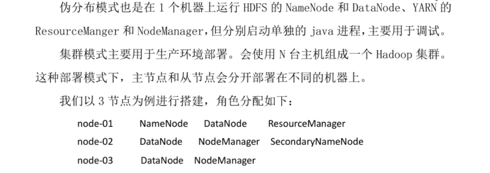
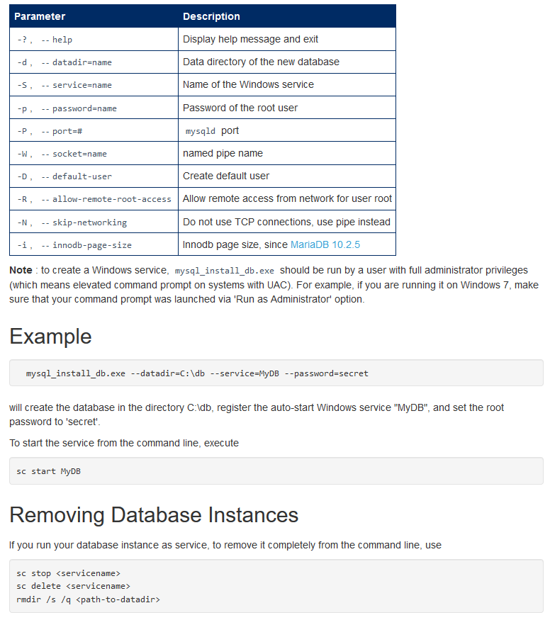

## 网络（centos6）
```
ip信息：  ip address  
网络主机绑定IP地址：/etc/hosts

查看所有网卡设备的信息
命令：cat /etc/udev/rules.d/70-persistent-net.rules
解析:SUBSYSTEM=="net", ACTION=="add", DRIVERS=="?*", ATTR{address}="00:15:5d:38:67:03", ATTR{type}=="1",KERNEL=="eth*", NAME="eth0"

查看指定网卡配置信息:
命令：cat /etc/sysconfig/network-scripts/ifcfg-eth0
解析：ifcfg-[网卡设备名称] 对应网卡设备信息里面的NAME,比如eth0,eth1
DEVICE=eth0 //对于网卡设备的NAME
HWADDR=00:15:5D:38:67:03 //对于网卡设备的ATTR{address}
TYPE=Ethernet
ONBOOT=yes //这个默认是no,表示开机不启用该网卡
NM_CONTROLLED=yes
BOOTPROTO=dhcp

ifconfig    ping  地址  -c次数      nslookup www.baidu.com
```
## 网络（centos7）
```
nmtui:tui(文本界面)形式的管理工具,相关的有cui(命令行界面)和gui(图形界面)
	功能：设置固定IP,开机启用等等
网卡命名规则：
	en： ethernet以太网卡
	o：主板集成网卡
	p：PCI独立网卡
	s：热插拔网卡
	nnn数字：MAC+主板信息（生产唯一序号）
例如：ens333,就是以太网卡-热插拔-nnn数字
依据网卡命名规则，会自动生成网卡的配置文件：/etc/sysconfig/network-scripts/ifcfg-ens333
	可以使用winscp打开配置进行各项修改，里面的项和centos6的差不多
DNS配置文件（对应windows的host文件）:/etc/resolv.conf
ip addr:查看当前各个网卡信息，对应于windows的ipconfig
```
## 本地磁盘和文件
```
linux系统的目录结构约定
/				    根
 |---bin    常用命令对应的执行程序
 |---dev    设备对应的文件抽象
 |---etc    系统及第三方程序的配置文件
 |---home   各个用户的家目录
 |---lib    动态类库
 |---media  自动挂载
 |---mnt    手动挂载
 |---root   root用户的家目录
 |---usr    第三方程序的安装目录

df [-h 美化结果] [-i inode相关的信息]
	查看磁盘分区、容量等信息
ln 源路径 目标路径 [-s 符号链接]
	创建硬链接，不占用磁盘空间，和复制文件存在本质的区别,和指针类似,特别的：文件夹不能创建硬链接
	符号链接,等价于windows的快捷方式，文件夹可以创建符号链接
pwd
	当前所在的位置，printf working directory
ll [-h 美化结果] [-R 递归子目录] [-a 展示所有] [-i inode编号]
	列举目录结构，实际上并没有名为ll的可执行程序，本质是ls -l的昵称，在/etc/profile文件中添加一行：alias ll='ls -l'
	ll . -h的结果如下：
	|----------------------------------------------------------------------------------|
	|  type,right  | ln	|  owner  |  group |   size  |    lastmodify      |   name     |
	|----------------------------------------------------------------------------------|
	|  drwxr-xr-x  | 7  |	 root   |  root  |   6.4M  |    Jul  3  2019    |   ak.zip   |
	|  drwxr-xr-x  | 7 	|	 root   |  root  |   9.2G  |    Jul  2  2018    |   win7.iso |
	|----------------------------------------------------------------------------------|
	type,right列，类型和权限
		第1个字符表示文件类型，各个字符表示的类型为：-：普通文件，d：目录，l：符号连接，b：块设备，c：字符设备，s：socket文件，p：管道
		rwx分别是可读、可写、可执行，如果对应位置是-,则表示无此项权限
		第一组rwx是所有者权限
		第二组rwx是所在组的权限
		第三组rwx是其他用户的权限
	ln列，硬链接的数量
	owner,所有者
	group,所在的组
chmod 755 路径
	修改文件权限，和rwx呼应，把rwx对应为3位2进制，那么每组rwx可取的值就是[0,7],1组rwx转为一个[0-7]的值，3组rwx就转为一个3位的值代表权限值
	---:0
	--x:1
	-w-:2
	-wx:3
	r--:4
	r-x:5
	rw-:6
	rwx:7
	所以，755等价于rwxr-xr-x
chown 所有者名称或所属组名称 路径
	修改所有者或者所属的组
echo 字符内容
	打印指定的字符内容
	利用$符号，$后面跟变量名称，可以打印系统的PATH环境变量值：echo $PATH
mkdir 目录路径 [-p 递归创建多层级目录]
	创建目录
rmdir 目录路径
	删除目录，只能删除空目录，鸡肋
touch 文件路径
	创建文件，touch只能创建空文件，如果需要创建包含内容的文件，可以利用echo或者dd
	echo helloworld > hello.txt
	dd
rm 路径 [-r 递归删除] [-f 强制执行,无需手动确认]
	删除文件或目录，如果删除目录，需要-rf
cp 源路径 目标路径 [-r 递归复制,自动创建各个子目录]
	复制文件或目录
mv 源路径 目标路径
	剪切文件或目录，可以用来进行重命名文件，不会自动创建目标路径中的各个子目录，如果子目录不存在则失败
cat 文件路径
	查看普通文本文件内容
tail 文件路径 [-100f 行数] [& 自动刷新]
	查看文件文件末尾的内容，场景：查看最新的日志信息
	类似的查看文件内容的命令：head more less等
grep 指定的内容 文件或目录路径 [-r 从目录下的所有文件中进行匹配]
	查询指定文件中包含指定内容的行
	使用场景非常广泛，通常利用管道符号|，把其他命令的输出作为grep的输入，然后进行筛选，获取需要的信息
gzip
	解压缩
tar [z gz算法] [j bzip2算法] [x 解压缩] [c 压缩] [v 提示信息] [f 压缩包文件名]  [-C 压缩到指定目录]
	解压文件：tar zxvf xxx.tar.gz     默认解压后文件都被放在当前目录下
	压缩文件：tar zcvf xxx.tar.gz .   表示把当前目录的所有文件打成xxx.tar.gz文件，生成后的文件也在当前目录
vi 文件路径
	编辑模式←→命令模式←→末行模式
	打开文件后，默认进入命令模式，各个模式的切换方式如下，特别的：末行模式和编辑模式不能直接切换，需要借助命令模式中转
	命令模式 》 i或a 》 编辑模式
	编辑模式 》 ESC  》 命令模式
	命令模式 》  :   》 末行模式
	末行模式 》 ESC  》 命令模式
	命令模式下：方向键控制光标，
						dd删除光标所在行
						u撤销操作
						/要查找的值 从光标位置向下查找，光标会跳到匹配的内容并且高亮，n跳到下一个匹配的内容，N跳到前一个
						?要查找的值 从光标位置向上查找，光标会跳到匹配的内容并且高亮，n跳到下一个匹配的内容，N跳到前一个
	末行模式下：q退出，如果有修改，则退出失败
						wq保存并退出
						w保存
						q!退出不保存
						set nu显示行号
						set nonu不显示行号
						s/被替换的值/新值     替换光标所在行第一个匹配的值
						s/被替换的值/新值/g   替换光标所在行所有匹配的值
						%s/被替换的值/新值    替换所有行各行第一个匹配的值
						%s/被替换的值/新值/g  替换所有行所有匹配的值
od 文件路径
	以16进制模式查看文件内容
stat 路径
	查看inode的编号，大小，所在磁盘区块等信息
wc 路径
	查看文本文件的行数、目录的文件数等信息
du 路径 [-h 美化] [-a 显示所有，默认不显示文件]
	查看路径下各个文件、子目录所占用的磁盘空间
find 路径 [-name 指定名称] [-size 文件大小] [-type 类型]
	查找符合条件的文件，类似于windows资源管理器的搜索
	name条件，通配符*代表一个或多个字符，?代表一个字符
	size条件，+10k表示大于10k,-10M表示小于10M，如果按大小范围，就指定2个size条件
mount 设备路径 目标文件路径
	挂载， 挂载U盘，FTP，光驱等等
```
## 系统及配置
```
poweroff
	立刻关机
halt
	立刻关机，centos6好用，7不行，原因待研究
shutdown [-h 关机] [-r 重启] [now 立刻执行]
	关机或者重启
shutdown [-s] [-t 秒数]
	windows系统关机或者重启
free [-h 美化显示]
	内存使用情况
top 
	cpu使用情况
ps [-aux BSD格式显示所有进程] [-ef 标准格式展示所有进程]
	两种格式的区别在于显示的列不同
	常用场景：把ps的输出作为grep的输入，然后删选判断指定的进程是否存在及其详细信息
pstree
  进程树
  需要安装包：psmisc，everything版中可以找到，这个包没有其他依赖
kill [-l 列举所有信号] [-信号] [-pid 进程id]
	结束进程
ss
	列举所有在用的端口
lsof
	所有打开的file，是list of open file的简称，因为文件、网络、设备等等都是file，所以即可以访问常规数据，也可以访问网络连接和硬件
	所有端口：lsof -i [-P 显示端口值，默认是端口名称] [-4 只显示ip4的] [-6 只显示ip6的] 
	监听指定端口的进程: lsof -i:端口号
	打开指定文件的进程：lsof 文件全路径
	指定用户打开的所有file：lsof -u 用户名
	指定程序打开的所有file：lsof -c 程序名
who 
	查看当前用户
	tty1-tty6文字终端
	tty7带桌面的终端
	pts/0设备终端
	使用ctrl+alt+f1-f7进行文字和图形互相切换
which 程序名称
	指定程序所在的全路径，等价于windows的where
uname [-r] [-a]
	系统名称、内核版本等信息
env
	环境变量
	常用场景，查看PATH变量的值：env |grep PATH
export 环境变量key=值 
	临时修改指定环境变量的值，例如：export PATH="/tmp:$PATH" ，重新给环境变量里的PATH赋值，$PATH表示原来的PATH值，PATH值的各段用:分割
adduser 用户名
	创建用户, 这个本质是个脚本，后续会提示设置密码等步骤，非常方便
deluser 用户名
	删除用户
useradd
	创建用户，很多参数，鸡肋
userdel -r 用户名
	删除用户，这个会把用户对于的桌面文件夹删掉
groupadd 组名
	添加用户组 
passwd  用户名
	修改密码
su 用户名
	直接切换用户，不用logout
logout
	注销当前用户
man man
	帮助文档
/etc/hostname
	计算机名称
/etc/profile
	系统配置，环境变量等等
	永久修改PATH值，在文件末尾加一行 PATH="/tmp:$PATH"
	执行source /etc/profile ，让新配置生效
/etc/passwd
	所有的用户和相关信息
```
## 远程连接和文件服务
```
ssh
	ssh连接
scp
	super copy，基于ssh
局域网共享yum install samba --downloadonly --downloaddir ./download
映射网络驱动器 mount -t cifs -o username="administrator",password="xxx" //192.168.56.101/Downloads /LFIS_Release
挂载windows的共享 使用smbfs文件系统 mount -t smbfs -o username=xxx,password=xxx,-l //192.168.56.1/Downloads /mnt/hostDownloads
挂载windows的共享 使用cifs文件系统 mount -t cifs -o username="xxx",password="xxx" //192.168.56.1/Downloads /mnt/Downloads/ 
安装文件系统 install cifs-utils
重启系统的时候自动mount, 将下面命令行添加到/etc/fstab里。
//192.168.56.1/Downloads /mnt/downloads/ cifs defaults,username=Deroom,password=密码 0 2 
```
## systemd
```
chkconfig --list 列出所有的服务
chkconfig  服务名称	[on/off]开机启动/开机不启动
service 服务名成 [start/stop/restart]
systemctl //列出正在运行的服务
systemctl list-unit-files //所有已经安装的服务
systemd-cgls   以树形列出正在运行的进程，它可以递归显示控制组内容
systemctl start postfix.service  启动一个服务
systemctl stop postfix.service	停止
systemctl restart postfix.service	重启
systemctl status postfix.service	查看服务的状态
systemctl enable postfix.service	设置开机启动
systemctl disable postfix.service	设置开机不启动
systemctl is-enabled postfix.service	查看是否开机启动
```
## yum
```
yum info mysql* available  //查询可用的程序
yum list installed  //查看所有已经安装的程序  
yum  localinstall docker-engine-selinux-1.12.6-1.el7.centos.noarch.rpm  --nogpgcheck  //本地安装
yum  localinstall docker-engine-1.12.6-1.el7.centos.x86_64.rpm --nogpgcheck
yum grouplist //列出所有的软件组 比如 genome desktop
yum group install 某个组的名称 //安装某个组的程序，一系列程序
yum --downloadonly --downloaddir ./download  //把指定的软件下载到本机目录，不进行安装 试用单个程序或者组
yum下载的包在哪里
cat /etc/yum.conf
cachedir=/var/cache/yum/$basearch/$releasever
keepcache=0
cachedir是软件包下载后保存的目录。但默认是不保存的，因为keepcache=0。若想要保存下载的软件包，必须将keepcache设置1才可以。

yum安装某个目录下的所有rpm文件：yum  localinstall 目录/* --nogpgcheck
比如已经切换到安装程序所在目录：yum  localinstall * --nogpgcheck
场景：目录下包含程序和该程序所有层级的依赖rpm文件

本地安装源
vbox程序中的光驱设备加载everything版的iso镜像
创建一个目录用于读取光盘镜像的文件，例如：/root/mycdrom
执行挂载：mount /dev/cdrom /root/mycdrom
可以查看mycdrom中的文件确认前面的操作是否ok
修改yum的源配置，把 /etc/yum.d/ 下的所有文件(除 )复制到 /etc/yum.d/bak 下

centos6安装桌面
yum groupinstall Desktop X Window System Chinese Surport
jdk
yum install java-1.8.0-openjdk-devel.x86_64 --downloadonly --downloaddir /root/jdk1.8
yum install java-11-openjdk-devel.x86_64 --downloadonly --downloaddir /root/jdk11
```
## 云原生
```
概念：云原生是一种新型技术体系，以容器、微服务、DevOps等技术为基础建立的一套云技术产品体系。
	云原生应用也就是面向“云”而设计的应用，在使用云原生技术后，开发者无需考虑底层的技术实现，可以充分发挥云平台的弹性和分布式优势，实现快速部署、按需伸缩
技术体系发展历程：物理机——虚拟机——云计算——容器——云原生
虚拟机：宿主机（物理服务器）上划分多台物理隔离的虚拟机，安装相同或不同的操作系统
云计算：计算+存储+网络+服务化，云和传统最大的区别：按需要分配，传统场景下,资源都在自己手里，用不了就浪费
	云计算技术分层：IaaS（2006落地产品）,PaaS（2009落地产品）,SaaS
	云计算技术流派：Eucalyptus,cloudstack,openstack
容器：宿主机(物理服务器或虚拟机)上划分多个部分隔离的空间，共享操作系统
云原生：云计算+容器+微服务+DevOps
发展历程中的商业竞争：
	容器引擎之争：docker公司的docker VS CoreOS公司的rocket
	容器编排之争：Docker swarm VS Kubernets VS Apache Mesos
2015年6月Docker成立OCI组织，定义各种规范，容器运行时规范，镜像格式规范，镜像分发规范，解决容器的构建、分发和运行问题
2015年7月Google成立CNCF(Cloud Native Computing Foundation),解决应用管理及容器编排问题
虚拟化技术发展历程：
	完全虚拟化：应用程序——虚拟机操作系统——虚拟机监视器——宿主操作系统——硬件
	半虚拟化：应用程序——虚拟机操作系统——虚拟机监视器——硬件（需要修改宿主操作系统内核，代表作：xen）
	操作系统虚拟化：应用程序——宿主操作系统——硬件（代表作：docker）
	操作系统虚拟化是容器和云原生的基石
```
## docker概述
```
2013年：docker公司发布docker
2016年：docker开源并将containerd捐赠给了CNCF
docker组件：
docker engine:也叫做doker daemon或dockerd，用于启动服务守护进程，dockerd启动时会启动containerd子进程
containerd:符合OCI标准的容器运行时，强调简单性、健壮性和可移植性，可以直接单机运行一个容器
containerd-shim:为了支持多种OCI Runtime,containerd内部使用containerd-shim(垫片),每启动一个容器都会创建一个新的containerd-shim进程，指定容器id,bundle目录
runC:根据OCI标准创建和运行容器

容器底层关键技术：
通过namespace实现资源隔离，一个宿主机可以跑多个容器，容器之间特定资源需要隔离,IP,用户等
通过cgroups实现资源限制，限制某个容器使用的资源量，避免容器过度使用资源
通过联合文件系统提高存储效率，容器虽然轻量，N个容器跑起来占用的空间也会很多，需要特殊的存储方式

安装docker1.12,准备主程序和所有依赖文件,docker1.12和centos7.2(1511)适配度高

切换到docker的程序和依赖目录,执行：yum  localinstall ./* --nogpgcheck
激活开机启动：systemctl enable docker
重启服务器
查看docker deamon程序状态：docker info
docker -v //查看版本
docker info //查看信息
```
## docker镜像
```
镜像：打包好的环境和应用，对应不可变基础设施
容器：运行镜像的势力，镜像是静态的，容器是动态的
仓库：存放多个镜像的仓库
	修改仓库地址，使用华为云加速地址，增加文件：/etc/
列出本地所有镜像：docker images
	docker images -aq
镜像完整名称=(IP/域名)/仓库名/镜像名:tag
	不指定IP/域名，默认为官方地址，即docker-hub
	不指定仓库名，则为该地址下的默认仓库，docker-hub称为官方仓
	必须指定镜像名
	不指定tag值，默认为latest，这是一个动态值，总是指向当前的最新的tag值
查询远程仓库的镜像：docker search 镜像名称
下载镜像：docker pull 镜像完整名称
	docker pull centos:7.2.1511
	下载镜像的默认存放路径：/var/lib/docker/devicemapper
	centos下的docker使用devicemapper存储驱动，有些系统下使用overlay驱动
	存放的具体路径和docker使用的存储驱动有关，但都是在/var/lib/docker里面
登陆：docker login
	假定基于harbor的docker镜像仓库地址：docker login 192.168.56.1
推出：docker logout
上传镜像：docker push
	先登录制定的镜像仓库
	然后镜像tag：docker tag centos:7.2.1511 192.168.56.1/myimgs/centos:7.2
	然后：docker push 192.168.56.1/myimgs/centos:7.2 
删除镜像：docker rmi
标记镜像：docker tag 镜像原名称(完整) 镜像新名称(完整)
	docker tag centos:7.2.1511 centos:7.2
	镜像完整名称：镜像名称:标签值
	特殊标签：latest，最新版本，指定镜像名的时候，如果不明确指定tag，就是latest
导出镜像：docker save
	docker save centos -o /root/centos.20220621.tar
导入镜像：docker load
	docker load < /root/centos.20220621.tar
查看日志：docker log
	如果容器起不来，利用这个查看报错原因

公网镜像仓库，dockerhub
私网镜像仓库
公有仓库：客户端上传需要登陆仓库，下载不需要登陆
私有仓库：客户端上传与下载都要登陆仓库
docker login //登陆仓库
从dockerhub下载的公开镜像不能直接上传到私网镜像，需要重新tag,然后上传
Harbor可以快速搭建一个企业级的镜像仓库
修改linux的主机名称，hostnamectl set-hostname 主机名称
安装docker-compose,docker官方在单台机器的编排工具，1.24.1
docker-compose down //停止本机的doker 容器
docker rmi `docker images -aq`//linux执行符号，
	docker rmi $(docker images -aq)
docker push centos:7.6 
配置docker不走https,vi /etc/docker/daemon.json  "insecure-registries":["192.168.56.104"]
docker tag centos:7.6 192.168.56.104/library/centos:7.6
docker push 192.168.56.104/library/centos:7.6
docker login 仓库ip

指定基础镜像：FROM
	FROM centos:7.2.1511
	FROM 192.168.56.103/myimgs/centos:7.2
指定作者信息(可选)：MAINTAINER
	MAINTAINER eeroom
添加属性信息（可选，可多个）：LABEL
	LABEL version="1.0"
	LABEL seek="vbc"
执行命令：RUN
	构建镜像过程中执行的命令，比如镜像需要安装httpd
	RUN yum localinstall /root/httpd/* --nogpgcheck
	优化点：有多条命令的时候，不要使用多条RUN,尽量使用&&符号和\符号连接成一行，多条RUN导致镜像创建多层
执行命令：CMD
	容器启动的时候要执行的命令，只能有一个CMD,有三种格式:
	CMD ['命令','参数1','参数2']
	CMD ['参数1','参数2']
	CMD 命令 参数1,参数2
执行命令：ENTRYPOINT
	和CMD类似
	和CMD的区别：可以有多个，最后一个生效，CMD可以被run容器的时候传提的命令覆盖，ENTRYPOINT的命令不能被覆盖
定义变量：ARG
	ARG a=3
	构建过程中使用的变量，参数值必须在dockfile中指定，不能从外面传入
	使用方式：$变量名称
	RUN中可以用ARG定义的变量，CMD用不了ARG定义的变量
定义变量：ENV
	ENV a=4
	和ARG类似，区别：可以被run时的参数覆盖，对应-e a=12
	RUN和CMD中都可以使用ENV定义的变量
拷贝文件：ADD
	ADD 源 目标
	源可以是本地文件或者本地压缩文件（会自动解压），或者url地址（这时候add类似于wget）
	目标可以是容器内的绝对路径或者相对于工作目录的相对路径
拷贝文件：COPY
	COPY 源 目标
	和ADD类似，区别：源必须是dockerfile所在目录的一个相对路径(文件或目录)
	优点：简单，直观，完全可以替代ADD
挂载数据卷：VOLUME
	VOLUME ["挂载点1","挂载点2"]
	等价于 -v 宿主机的/var/lib/docker/volumes下的随机目录:挂载点1
	会被docker run 的-v命令覆盖
	查看自动挂载的随机目录：docker inspect 容器id ,可以看到随机目录的具体值
暴露端口：EXPOSE
	EXPOSE 80
	对应容器里面的端口，对应 -p 宿主机端口:EXPOSE的端口
	这个指定其实只是声明，最终由-p的参数值决定端口映射
指定用户：USER
	USER daemon
	可以是用户名或者UID，对应 -u 用户名
	默认是root用户
设置工作目录：WORKDIR 
	WORKDIR /root
	设定的是镜像内的工作目录
	等价于RUN cd /root
构建httpd的镜像
	FROM centos:7.2.1511
	MAINTAINER eeroom
	LABEL version="1.0"
	LABEL description="first httpd"
	WORKDIR /root
	COPY httpd-1511/ httpd/
	RUN yum localinstall httpd/* --nogpgcheck -y \
		&& rm -rf  httpd \
		&& echo "wwch" > /var/www/html/index.html
	VOLUME ["/var/www/html"]
	EXPOSE 80
	CMD ["/usr/sbin/httpd","-D","FOREGROUND"]
构建tomcat的镜像
	FROM centos:7.2.1511
	LABEL MAINTAINER="eeroom" version="2.2"
	ENV JAVA_HOME=/usr/local/jdk-11.0.2
	COPY jdk-11.0.2 /usr/local/jdk-11.0.2
	COPY apache-tomcat-8.5.81 /usr/local/apache-tomcat-8.5.81
	VOLUME ["/usr/local/apache-tomcat-8.5.81/webapps"]
	EXPOSE 8080
	CMD ["/usr/local/apache-tomcat-8.5.81/bin/catalina.sh","run"]
查看镜像分层：docker history 镜像名称
镜像优化：
	基础镜像使用 alpine ，Tiny Core Linux 等体积小的镜像
		alpine不使用glibc,centos等系统用的都是glibc
	多阶段构建
		多个FROM ,在前面的FROM 中编译，COPY结果到后面的FROM ,避免镜像中包含编译环境，最终减少镜像体积
```
## docker容器
```
查看正在运行的容器：docker ps
新增容器：docker create 镜像名
运行容器（新增并运行）：docker run 镜像名称	[容器里面要执行的命令]
	docker run centos:7.2.1511  echo seek
	镜像本身包含默认命令，如果在run语句中不指定命令，则容器执行其镜像里的默认命令
	跑容器类似于执行可执行程序，命令执行完容器就结束了，并且输出被重定向到宿主的终端，如果需要容器一直执行，需要执行持续性的任务
		docker run centos:7.2 /bin/bash -c 'while true;do echo wch;sleep 1;done'
	后台运行,-d 容器输出不会被重定向到宿主的终端
		docker run -d centos:7.2 /bin/bash -c 'while true;do echo wch;sleep 1;done'
	指定容器名称，--name=容器名称 或者 --name 容器名称
		docker run -d --name=wch1 centos:7.2 /bin/bash -c 'while true;do echo wch;sleep 1;done'
	交互，-it 重定向了容器的输入和输出，因为重定向了输入，类似于持续任务，在交互期间容器会一直运行，一旦执行exit退出容器，则容器关闭
		docker run -it centos:7.3.1611
		可以看到当前终端登录的是容器内的centos7.3,使用uname查看系统信息，系统内核仍然是7.2的
	端口映射，-p 宿主机端口:容器端口
		docker run -itd -p 8004:80 centos:7.2
		需要宿主机打开 ip_forward （跨网段路由）,/etc/sysctl.conf 文件中设置 net.ipv4.ip_forward=1
			centos7.2minimal系统中默认已经打开，查看方法：sysctl -a |grep ip_forward
		容器内安装 httpd,然后容器内使用httpd命令直接启动服务,修改httpd的主页内容： echo helloworld > /var/www/html/index.html
			不能使用systemctl启动httpd服务，因为容器本身是宿主机systemd下的一个进程，容器本身没有systemd,不能使用systemctl
		使用容器的ip访问主页，curl 172.17.0.2/index.html
			在宿主机执行docker inspect 查看容器的ip,局限：只能是宿主机机或者兄弟容器或者自己访问
		使用宿主机id访问主页，curl 192.168.56.102:8004/index.html
			必须要端口映射 -p 8004:80
	容器开机自启动：--restart=always
	传参给镜像内部：-e 参数名称=参数值
		参数名称由镜像决定
容器内执行命令：docker attach 
	退出的时候会自动停止容器，不推荐使用
容器内执行命令：docker exec 容器名称/容器id 命令
	docker exec wch1 touch /abc
		这样会在容器内创建文件/abc
容器内执行命令(交互式)：docker exec -it 容器名称/容器id /bin/bash
	docker exec -it wch1 /bin/bash
	然后执行ls / ；可以看到被创建的abc文件
拷贝文件（夹）：docker cp 源文件 目标文件
	docker cp /root/123 wch:/123
	docker cp wch:/abc /abc
	容器内的文件（夹）路径=容器名称：/正常路径
终端与容器进行交互（附加式）：docker exec -it 容器名称/容器id  /bin/bash
提交容器为镜像：docker commit 容器名称/容器id 新的镜像名称
	场景：往容器中安装了新软件或改了配置，想保存为新的镜像
	这是自定义镜像的方法之一，不太科学，科学做法是：在容器所属镜像的基础上直接创建新镜像
	以端口映射中的端口映射为例，commit为新镜像后，使用正常docker run 不能启动httpd服务，必须加参数 -D FOREGROUND ，表示程序放到前台运行
		 docker run [-itd] -p 9001:80 azeroth:httpd /usr/sbin/httpd -D FOREGROUND
		 commit生成的镜像继续沿用原镜像的默认命令，不能修改默认命令为/usr/sbin/httpd
		 容器本身就是进程，无法将容器内的服务放到后台运行，
	容器里面都是以直接方式启动服务，不使用systemctl start
	特别的，启动httpd 需要加-D FOREGROUND
		启动nginx 需要修改/etc/nginx/nginx.conf文件，增加 daemon off;
删除容器：docker rm 容器名称/容器id
	不能删除正在运行的容器，删除所有已经停止的容器
停止容器：docker stop 容器id/容器name
	停止所有正在运行的容器：docker stop $(docker ps -q)
查看容器内的输出：docker logs 容器id
查看容器或镜像的所有配置参数：docker inspect 容器id/镜像id
启动指定容器：docker start 容器id
挂载数据卷：-v 宿主机文件（夹）：容器内文件（夹）
	场景：容器内配置文件需要修改、容器内数据需要保存、不同容器之间共享数据
	指定的宿主机上的文件（夹）如果不存在会自动创建，自动创建的一定是文件夹，如果需要映射文件，需要提前在路径下准备好
	docker run -itd -p 8001:80 -v /root/www:/var/www/html azeroth:httpd /usr/sbin/httpd -D FOREGROUND
	可以映射多个,很多镜像里面的时区不是北京时区，导致时间不一致，映射时区文件可以解决这个问题
	docker run -itd -p 8001:80 -v /root/www:/var/www/html -v /etc/localtime:/etc/localtime azeroth:httpd /usr/sbin/httpd -D FOREGROUND
	映射mysql的数据文件：-v /root/mysqldata:/var/lib/mysql
		 docker run -d -p 3306:3306 -v /root/mysqldata:/var/lib/mysql --restart=always -e MYSQL_ROOT_PASSWORD=123456 mysql:5.6
	映射nginx的主目录：-v /root/nginxhome:/usr/share/nginx/html
	映射httpd的主目录：-v /root/httpdhome:/var/www/html
	映射tomcat主目录：-v /root/tomcathome:/usr/local/tomcat/webapps
docker create 镜像名 //新增容器
docker rm 容器ID //删除容器
docker run 参数
--name 自定义容器名称
-d 容器后台运行
-p 当前系统端口：容器端口 端口映射（容器内部端口映射外部）
-v 当前系统目录：容器目录 目录映射
例子：docker run -it --name 容器名称 repository:tag /bin/bash //以交互方式启动
docker exec -i -t 通过docker ps查看的name名 /bin/bash
// 停止所有容器
docker ps -a | grep "Exited" | awk '{print $1 }'|xargs docker stop
// 删除所有停止的容器
docker ps -a | grep "Exited" | awk '{print $1 }'|xargs docker rm
// 删除所有tag标签是none的镜像
docker images|grep none|awk '{print $3 }'|xargs docker rmi
```
## docker网络
```
节点网络：docker host之间的
容器网络：容器本身的网络
服务网络：

单宿主机容器互联
	--link 被互联的容器名称:别名
	原理：容器起来之后，修改 /etc/host 文件，增加一条host记录：被互联容器的ip 	别名 被互联容器的名称 被互联容器的id
	容器之间默认通过ip也是互通的
	容器里面通过命令：ping 别名		可以看到结果是被互联的那个容器的ip
NAT网络，内到外是SNAT,外到内是DNAT
docker network
	查看所有已有的网络： ls
	创建网络：create
	swarm集群网络
	local本地网络：
		bridge等价于虚拟机的桥接网络，桥接对象是宿主机的docker0网卡(172.17.0.1)
		host 和宿主机共享网络，和宿主机网络一模一样，没有隔离
		none 不能与外网通讯，只能本机回环网络
指定容器使用的网络：--network=网络名称
	默认是名字为bridge的网络
两个容器共享同一个ip: --network=container:被共享的容器ip
Overlay网络是虚拟网络，是建立在Unerlay网络之上的网络。Overlay网络的节点通过虚拟的或逻辑的链接进行通信，每一个虚拟的或逻辑的链接对应于Underlay网络的一条路径(Path)，由多个前后衔接的连接组成。在VXLAN构建的网络中，我们把通过VXLAN隧道建立的基础网络称之为Underlay网络，而在VXLAN隧道之上所运行的业务网我们称为Overlay网络，VXLAN的Overlay网络使用Underlay网络的控制平面和数据平面来传递报文。
跨host的容器互联,有各种方案
	flannel,calico，传统路由方式
负载三种方案：ngnix	 haproxy lvs(IPVS)
高可用：keepalived(主备模式的高可用，双击热备)

```
## docker compose
```
compose版本	docker版本
3.2					17.04.0+
3.1					1.13.1+
2.2					1.13.0+
2.1					1.12.0+
2.0					1.10.0+

containerd
	ctr
	crictl

自动化运维：ansible
```
## docker资源隔离
```
linux内核提供6中namespace隔离
主机名或域名：UTS,每个NameSpace都拥有独立的主机名或域名，可以把每个NameSpace认为一个独立主机
信号量、消息队列和共享内存：IPC，每个容器依旧使用linux内核中进程交互的方法，实现进程间通信
进程编号：PID，每个容器都拥有独立的进程树，容器是物理机的一个进程，容器中的进程是宿主机的线程
网络设备接口，IP路由表，防火墙规则等：net，每个容器的网络隔离
挂载点：mount，每个容器的文件系统独立
用户和用户组：user，每个容器的用户和组隔离，每个容器都有自己的root用户
特别的：
	两个容器的网络可以共用IP地址，主机名不同，其他是隔离的
	两个容器的Mount存储部分公用，其它是隔离的
```
## docker资源限制
```
cpu限制，通过run的参数设置
内存限制，通过run的参数设置
磁盘IO限制
	dd命令写一个具有实际10M大小的文件：dd if=/dev/zero of=/root/myfile bs=1M count=10
	/dev/null，外号叫无底洞，你可以向它输出任何数据，它通吃，并且不会撑着
	/dev/zero，是一个输入设备，你可你用它来初始化文件。该设备无穷尽地提供0
```
## docker存储驱动
```
一个镜像起多个容器，容器并不会立刻占用和镜像相同的磁盘空间，而是直接读取镜像内的文件，如果涉及修改才往容器自己的文件内写入修改后的文件，简称（写时复制，用时分配）
	和虚拟机差分磁盘的玩法一模一样
联合文件系统：交互式登录容器后，我们看到的数据是镜像空间和容器自己空间联合挂载的文件系统呈现出来的数据
	类似于PS的图层玩法
	docker最开始采用AUFS作为文件系统（分层概念），实现多个容器共享一个镜像，分层核心：最上层是读写层，其他的都是只读的镜像层
	但是AUFS只支持Ubuntu，一直没被纳入linux内核，所以docker最开始只能支持Ubuntu，0.7版本引入存储驱动层
	docker支持存储驱动：AUFS,OverlayFS,Btrfs,Device mapper,ZFS
```
## docker客户端教程
```
Docker服务端提供RestfulAPI，默认不允许远程访问，所以需要修改服务端配置
服务端开放TCP连接的方法
修改/etc/docker/daemon.json，没有就新增
内容：{"hosts":[ "unix:///var/run/docker.sock", "tcp://0.0.0.0:2375" ]}
重启服务或者服务器，查看2375端口是否开放，ss -l |grep -Po '\s[^\s]*2375\s'
客户端连接服务端：docker -H tcp://192.168.56.101:2375 version
docker -H 192.168.56.101:2375 version
客户端每次运行都需要指定 -H tcp://192.168.137.21:2375,比较麻烦，可以通过：export DOCKER_HOST="tcp://192.168.137.21:2375" 建立一个环境变量
windows环境下 cmd 使用 set DOCKER_HOST=tcp://192.168.56.101:2375
连接成功，可以运行： docker info 查看远程docker的信息
```
## docker-machine
```
安装dockertoolbox就有docker客户端和dockermachine
帮助：docker-machine -h
可以再各个命令后面再接-h查看详细的参数说明
查看已注册的docker服务端：docker-machine ls
创建或者注册docker服务端，根据driver:
场景：centos7，自己安装了docker1.12,只是为了把该docker添加到windows下docker-machine列表，方便管理
添加已有（docker安装后不要配置systemd的开机启动，否则machine重新配置docker的时候会冲突）：	docker-machine create  --driver generic --generic-ip-address 192.168.56.102 whc  machine名称（自定义）
新建和添加已有的命令是一样的
使用PS,执行：docker-machine env machine名称，会得到一个执行命令
 docker-machine env yt | Invoke-Expression
 执行后,在windows上执行docker命令等价于在centos上执行，类似于docker -H 192.168.56.101:2375
移除machine:docker-machine rm
```
## doker部署netcore程序
1. `设定dockfile文件为编译输出`
```
修改项目文件，增加一行：<None Include="Dockerfile" CopyToPublishDirectory="Always" />
目的：dockerfile文件始终复制到发布后的目录
```
1. 在windows环境下publish项目
```
dotnet publish  //用这个就可以，为当前目录中的项目创建一个 依赖于运行时的跨平台二进制文件：
交叉编译:发布到linux64 dotnet 命令为：dotnet publish -r linux-x64 //不需要这样编译
```
1. 在windows的docker客户端build镜像
```
命令： docker build -t 镜像名称 Dockerfile所在的路径
例如：docker build -t wch .\bin\Debug\netcoreapp2.0\publish\
Dockerfile内容：
FROM microsoft/aspnetcore:2.0
#指定一个workdir，目录随便
WORKDIR /app
#把相对dockerfile所在目录的相对路径的文件 复制到 workdir相对路径的位置
COPY . .
#声明系统运行需要用到的端口，只是声明，方便创建容器的人知道需要处理哪些端口映射
expose 80
#等价于cmd的dotnet命令 
ENTRYPOINT ["dotnet", "Azeroth.Klz.dll"]
```
1. 在windows的docker客户端run一个容器
```
docker run -it --rm -p 容器外部端口:容器内部端口 --name 容器名称 镜像名称
docker run -it --rm -p 5000:80 --name wch123 wch
```
1. 访问容器所在的linux的地址
```
http://192.168.56.101:5000/api/values
```
1. 制作bat脚本
```
步骤总结为：发布程序，build镜像，创建容器及运行，删掉tag是none的镜像（也就是老版本的镜像）
脚步内容：
dotnet publish
docker build -t wch .\bin\Debug\netcoreapp2.0\publish\
docker stop wch123
docker rm wch123
docker run -d -it --rm -p 5000:80 --name wch123 wch
docker images|grep none|awk '{print $3 }'|xargs docker rmi
```
1. 微软文档[FAQ:](https://docs.microsoft.com/zh-cn/dotnet/core/tools/dotnet-publish)

## hadoop部署模式
### 
## hadoop搭建集群
```
vbox新建三台机器后，centos7会自动配置网卡，比centos6方便，centos6需要更新网卡配置文件里的mac地址才能访问网络
准备三台机器，hadoopNameNode,hadoopDataNode1,hadoopNameNode2
修改机器的名称 /etc/hostname
修改机器的hosts文件 /etc/hosts
安装jdk1.8，yum localinstall以后不会设置环境变量，因为已经配置的PATH，所有可以直接运行java和javac，但是仍然需要设置相关环境变量，其他程序依赖这个这几个环境变量的值
JDK全局环境变量配置
export JAVA_HOME=/usr/java/jdk1.8.0_231-amd64
export CLASSPATH=.:$JAVA_HOME/lib/dt.jar:$JAVA_HOME/lib/tools.jar
export PATH=$PATH:$JAVA_HOME/bin
把hadoop安装程序上传到hadoopNameNode ，目录/export/server/,直接解压到当前目录，tar zxvf hadoop-2.7.4.tar.gz
配置文件修改
/export/server/hadoop2.7.4/etc/hadoop//hadoop-env.sh，找到 export JAVA_HOME={JAVA_HOME}，修改为export JAVA_HOME=/usr/java/jdk1.8.0_231-amd64
/export/server/hadoop2.7.4/etc/hadoop/core-site.xml，
<configuration>
	<property>
		<name>fs.defaultFS</name>
		<value>hdfs://hadoopNameNode:9000</value>
	</property>
	<property>
		<name>hadoop.tmp.dir</name>
		<value>/home/hadoop2.7.4_data</value>
	</property>
</configuration>

hdfs-site.xml，
<configuration>
	<property>
		<name>dfs.replication</name>
		<value>2</value>
	</property>
	<property>
		<name>dfs.namenode.secondary.http-address</name>
		<value>hadoopDataNode1:50090</value>
	</property>
</configuration>

mv mapred-site.xml.template mapred-site.xml
<configuration>
	<property>
		<name>mapreduce.framework.name</name>
		<value>yarn</value>
	</property>
</configuration>

yarn-site.xml
<configuration>
	<property>
		<name>yarn.resourcemanager.hostname</name>
		<value>hadoopNameNode</value>
	</property>
	<property>
		<name>yarn.nodemanager.aux-services</name>
		<value>mapreduce_shuffle</value>
	</property>
</configuration>

slaves
hadoopNameNode
hadoopDataNode1
hadoopDataNode2

把hadoop的程序路径配置到环境变量
export HADOOP_HOME=/export/server/hadoop2.7.4
export PATH=$PATH:$HADOOP_HOME/bin:$HADOOP_HOME/sbin

虚拟机内存不要低于2048，512和1024MB的情况下，hadoop可以正常启动起来，但是执行demo程序，resourcemanager就出错终止运行了

下发配置好的文件到其他机器 scp -r /export/server/hadoop2.7.4 root@hadoopDataNode1:/export/server/hadoop2.7.4/
scp -r /export/server/hadoop2.7.4 root@hadoopDataNode2:/export/server/hadoop2.7.4/
下发环境变量配置文件
scp -r /etc/profile root@hadoopDataNode2:/etc/
scp -r /etc/profile root@hadoopDataNode1:/etc/

刷新环境变量 source /etc/profile

配置文件说明
***-default.xml 这里面配置了hadoop默认的配置选项
如果用户没有修改，那么这里面的选项将会生效
***-site.xml 这里面配置了用户需要自定义的配置选项
site中配置的值优先级大于default中的配置项的值
```
## HDFS ON Windows
```
windows下搭建HDFS，不依赖cygwin，
解压hadoop的tar.gz包，使用管理员权限解压
找到对应的hadoop-winutils,按照对应的说明进行替换
增加环境变量，HADOOP_HOME
增加/bin和/sbin到PATH，方便后续执行命令
涉及的命令，hdfs.cmd,start-hdfs.cmd
如果环境变量配置的jdk不是1.8，修改etc\hadoop\hadoop-env.cmd文件，设置JAVA_HOME为1.8版本的jdk
修改配置文件:conf/hadoop-site.xml:
<configuration>
	<property>
    <name>fs.default.name</name>
    <value>hdfs://localhost:9000/</value>
  </property>
  <property>
    <name>mapred.job.tracker</name>
    <value>localhost:9001</value>
  </property>
  <property>
    <name>dfs.replication</name>
    <value>1</value>
  </property>
  <property>
		<name>hadoop.tmp.dir</name>
		<value>file:/D:/01Tools/hadoopdata</value>
  </property>
</configuration>
修改配置文件：hdfs-site.xml
<configuration>
	<property>
		<name>dfs.namenode.name.dir</name>
		<value>file:/D:/01Tools/hadoopdata/namenode</value>
	</property>
	<property>
		<name>dfs.datanode.data.dir</name>
		<value>file:/D:/01Tools/hadoopdata/datanode</value>
	</property>
</configuration>
格式化文件系统：hdfs namenode -format
启动HDFS文件系统：start-dfs.cmd
停止HDFS文件系统：stop-dfs.cmd
查看HDFS系统的信息：http://localhost:50070
创建目录：hdfs dfs -mkdir -p hdfs://localhost:9000/a/b/c
上传文件：hdfs dfs -put d:\wifi密码.txt hdfs://localhost:9000/a/b/c/
其它操作：hdfs查看帮助

把start-dfs.cmd安装为windows服务：
复制srvany.exe到D:\01Tools\hadoop-2.7.1;
执行：instsrv.exe apache_HDFS D:\01Tools\hadoop-2.7.1\srvany.exe；
修改注册表：HKEY_LOCAL_MACHINE\SYSTEM\CurrentControlSet\Services\apache_HDFS
增加项：Parameters
增加字符串：Application=D:\01Tools\hadoop-2.7.1\sbin\start-dfs.cmd
AppParameters=
AppDirectory=D:\01Tools\hadoop-2.7.1\sbin\
```
## hadoop运行和调试
```
启动hadoop集群，需要启动HDFS集群，YARN集群
首次启动HDFS集群，需要对其进行格式化（初始化），格式化只能进行一次，和yarn没有关系,集群启动成功以后，不要再进行格式化
在namenode所在的机器上进行hdfs格式化
格式化命令：hdfs namenode -format，执行后需要等待

脚本启动hdfs集群，也可以单点一个个启动，
前提条件，namenode到其他机器免密登陆，配置文件slaves配置好了
脚本：/export/server/hadoop2.7.4/sbin/start-dfs.sh，也有配套的停止脚本
脚本启动yarn集群
脚本：/export/server/hadoop2.7.4/sbin/start-yarn.sh

查看状态 jps
单节点逐个启动
集群启动成功后，提供web查看[http://192.168.56.61:50070](http://192.168.56.61:50070)[http://192.168.56.61:8088](http://192.168.56.61:8088)

执行一个mapreduce
hadoop jar  hadoop-mapreduce-examples-2.7.4.jar pi 20 50
```
## windows局域网共享
```
映射网络上共享目录到指定盘符：net use Z: \\192.168.56.1\Downloads 密码 /user:Deroom
做成bat,然后开机启动，修改注册表，位置：HKEY_LOCAL_MACHINE\SOFTWARE\Microsoft\Windows\CurrentVersion\Run
类似于："diskZ"="C:\\Users\\Administrator\\diskZ.bat"
删除指定的映射	net use Z: /del 
```
## windows环境变量
```
通过注册表修改环境变量，位置：HKEY_LOCAL_MACHINE\SYSTEM\CurrentControlSet\Control\Session Manager\Environment

临时设置环境变量
查看所有环境变量 ls env:
查看某个环境变量 ls env:path
设置某个值 $Env:path=$Env:Path+";C:\Go\bin"

永久设置环境变量
set pp=%PATH%
setx PATH 
```
## windows解压缩
```
安装7z,下载命令行版本,然后修改环境变量，把7za.exe加入到PATH
压缩：7za a 压缩包全名称含路径 源文件路径
默认为7z格式，参数最少，比如：7za a wode.7z d:/dcq   
指定zip,比如：7za a -tzip a wode.zip d:/dcq
压缩的文件移除根目录级：7za a -r wode.7z d:/dcq
解压缩：7za x 压缩包全路径 -o目标文件夹
解压缩比如：7za x d:/abc/wode.7z -od:/目标
```
## win2008r2core配置网站服务
```
列出当前服务器的功能和状态:DISM /Online /Get-Features
打开WoW64：Start /w ocsetup ServerCore-WOW64
打开.NET2.0层：Start /w ocsetup NetFx2-ServerCore
打开.NET2.0层的WoW64: Start /w ocsetup NetFx2-ServerCore-WOW64
安装IIS
	dism /online /enable-feature /featurename:IIS-WebServerRole
    dism /online /enable-feature /featurename:IIS-ISAPIFilter
    dism /online /enable-feature /featurename:IIS-ISAPIExtensions
    dism /online /enable-feature /featurename:IIS-NetFxExtensibility
安装IIS-ASPNET
    dism /online /enable-feature /featurename:IIS-ASPNET
net462的前置补丁：windows6.1-kb4474419-v3-x64_.msu，net462的签名验证，新软件的签名验证
Windows6.1-KB2999226-x64.msu  解决安装vc++2015 （这个补丁装完要重启，否则net45安装直接报错）
	可选，不影响安装net45：vc++2012 2013 2015
NDP462-DevPack-KB3151934-ENU.exe（安装过程中会报错）或者dotNetFx45_Full_x86_x64.exe
安装servercore版net40或者net462或者net45
安装PS(依赖前面启用NET20) DISM /Online /Enable-Feature /FeatureName:MicrosoftWindowsPowerShell 
升级到ps3.0 依赖net40 或者ps4.0依赖net45
	Windows Management Framework 4.0对应ps4.0
关闭密码复杂性策略（用到powershell），才可以把密码改成123456，
	secedit /export /cfg c:\secpol.cfg
	echo. >c:\out.txt
	type c:\secpol.cfg | findstr -i complex >>c:\out.txt
	powershell -command "(GC C:\secpol.cfg) -Replace \"PasswordComplexity = 1\",\"PasswordComplexity = 0\" | Out-File C:\secpol.cfg"
	echo. >>c:\out.txt
	type c:\secpol.cfg | findstr -i complex >>c:\out.txt
	secedit /configure /db c:\windows\security\local.sdb /cfg c:\secpol.cfg /areas SECURITYPOLICY
	del /q c:\secpol.cfg
	type c:\out.txt
	del /q c:\out.txt
	del %windir%\security\logs\scesrv.log
```
## iis和appcmd
```
c:\windows\system32\inetsrv\appcmd.exe
总的命令格式：APPCMD (命令) (对象类型) <标识符> </参数1:值1 ...>
删除虚拟目录：
appcmd delete vdir 虚拟路径
查看所有的参数：appcmd list sites /text:*
appcmd list apppool /text:*
修改网站的应用程序池
appcmd set site "Default web site" -[path='/'].applicationPool:"ASP.NET v4.0"
查看某个对象的操作参数
appcmd set site "Default web site" /?
appcmd可以配置iis应用程序池和iis应用程序的所有参数，从配置文件导入新程序池或者新站点，修改配置，等等操作
所有参数结合2个配置文件可以得出
C:\Windows\System32\inetsrv\config\applicationHost.config,这个实际起作用的配置文件，iis运行时的配置文件继承这个，再结合用户的web.config
C:\Windows\System32\inetsrv\config\schema\IIS_schema.xml,这个文件是配置文件的元数据，所有的参数的名称和类型都可以查，特别是枚举类型，技巧：通过开发机图像界面配置iis，然后appcmd导出xml，然后作为脚本的一部分,在部署环境利用appcm导入xml里面的配置
```
## windows-MSBuild
```
.netframework包含完整的msbuild程序
配置环境变量，增加path,C:\Windows\Microsoft.NET\Framework64\v4.0.30319
msbuild不依赖visual studio
vs调用msbuild编译项目，并且vs按照项目类别把各类别对应的一些编译参数放在配置文件中，位置在：C:\Program Files (x86)\MSBuild，只有安装了vs才会有，在开发机上复制这个目录下的文件到server2008R2Core的同样位置。
调用msbuild的编译命令为：msbuild 解决方案.sln/项目.csproj 参数的配置文件。例如：msbuild JenkinsDemo.sln /p:VisualStudioVersion=14.0
如果复制的是vs2015的配置，参数为/p:VisualStudioVersion=14.0，这个参数会去C:\Program Files (x86)\MSBuild\Microsoft\VisualStudio\v14.0下面找
如果参数为/p:VisualStudioVersion=11.0，就会去C:\Program Files (x86)\MSBuild\Microsoft\VisualStudio\v11.0下面找
对应关系为：
	vs2010===11.0
	vs2012===12.0
	vs2015===14.0
调用msbuild的发布命令为：msbuild Mytech.csproj /p:DeployOnBuild=true /p:PublishProfile=uk001.pubxml /p:VisualStudioVersion=14.0
7z打包
执行scp把分发到远程机器
执行远程机器的ps脚本,执行后续的部署等操作
```
## Windows-ssh(openssh)
1. 安装
```
创建目录C:\Program Files\OpenSSH，想办法把文件放进去，win10，加载vhd，然后复制进去，或者打开宿主共享，然后复制
	局域网共享，然后 robocopy
顺便安装7za,把7za.exe,7za.dll,7zxa.dll放到system32目录
切到OpenSSh目录
powershell.exe -ExecutionPolicy Bypass -File install-sshd.ps1
显示3行成功
如果启用了防火墙，则
netsh advfirewall firewall add rule name=sshd dir=in action=allow protocol=TCP localport=22
设定服务自动启动
使用ps执行：Set-Service sshd -StartupType Automatic
```
2. 免密登录
```
配置免密登陆，场景：A免密登陆B，
B作为服务端，要修改sshd_config（不是ssh_config）文件，
	修改B中C:/ProgramData/ssh/sshd_config，注释掉2行，默认是在最后
	Match Group administrators
		AuthorizedKeysFile __PROGRAMDATA__/ssh/administrators_authorized_keys
	重启B的ssh和sshagent服务
	Centos7的为/etc/ssh/sshd_config，修改内容，默认情况这三行为注释掉的，只需要取消注释，按如下设置即可
	RSAAuthentication yes
	PubkeyAuthentication yes
	AuthorizedKeysFile	.ssh/authorized_keys
A作为客户端，要做的事情为：
A使用ssh-keygen生成公钥和私钥，参数全部默认，一路回车，在当前用户目录下的.ssh目录里面id_rsa，id_rsa.pub
打开id_rsa.pub复制里面的内容，追加到B的authorized_keys文件，文件位置为【用户名/.ssh/authorized_keys】 比如Administrator/.ssh/authorized_keys
centos:.ssh目录的权限为700，其下文件authorized_keys和私钥的权限为600,这是linux的安全要求，如果权限不对，自动登录将不会生效,
如果authorized_keys文件不存在就新建,
这里是把authorized_keys放在Administrator用户下，后续免密登陆就是使用Administrator用户，命令为：ssh Administrator@被免密登陆的机器IP
A上执行：ssh Administratro@192.168.56.101
```

3. ssh登陆卡
```
修改服务端的sshd_config（不是ssh_config），设置为如下：
UseDNS no
GSSAPIAuthentication no
```

## win2008r2Core配置sqlserver
```
在servercore2008R2中不能打开sqlserver的服务管理器,需要编辑注册表值来修改sqlserver服务的配置
配置sqlserverexpress，允许客户端通过tcp连接服务端，固定监听tcp1433端口
	修改注册表：HKEY_LOCAL_MACHINE\SOFTWARE\Wow6432Node\Microsoft\Microsoft SQL Server\MSSQL10.QLEXPRESS\MSSQLServer\SuperSocketNetLib\Tcp
	"Enabled"=dword:00000001
	"ListenOnAllIPs"=dword:00000001
	HKEY_LOCAL_MACHINE\SOFTWARE\Wow6432Node\Microsoft\Microsoft SQL Server\MSSQL10.QLEXPRESS\MSSQLServer\SuperSocketNetLib\Tcp\IPAll
	"TcpPort"="1433"
特别注意：32位的安装程序安装到64位，注册表要修改Wow6432Node下的。64位安装程序到64位系统则不用Wow6432Node，32位安装程序到32位系统也不用Wow6432Node
登陆：BT@151
数据库：123456
配置数据库允许sqlserver认证，安装的时候如果没有选择允许，命令行sql登陆，执行相应的sql语句，允许sa登录
在数据库所在机器使用sqlcmd连接数据库，然后执行sql语句，允许sa账号登陆
配置自动开启SQLBrowser，重启生效。这个服务监听udp1434。配合sqlserver服务的动态端口监听，
HKEY_LOCAL_MACHINE\SYSTEM\CurrentControlSet\services\SQLBrowser
Start=2
```
## windows-jdk
```
安装java的sdk
使用解压缩版文件，非安装版，winscp上传到指定目录
使用7za解压缩到c:/dw
配置环境变量，重启生效
HKEY_LOCAL_MACHINE\SYSTEM\CurrentControlSet\Control\Session Manager\Environment
JAVA_HOME=C:\dw\jdk-11.0.2
增加path的值
```
## windows-jenkins
```
安装jenkins，把jenkins.war放到tomcat的webapps目录下，重启服务
net stop Tomcat9
net start Tomcat9
安装jenkins
war文件
安装后amdin在用户管理修改密码
如果忘记admin的密码
打开/C:/Windows/ServiceProfiles/LocalService/.jenkins/users/admin/config.xml,找到密码部分， 修改为#jbcrypt:$2a$10$MiIVR0rr/UhQBqT.bBq0QehTiQVqgNpUGyWW2nJObaVAM/2xSQdSq
然后重启，使用123456登陆
插件相关
插件》高级》修改插件源的地址，使用https://mirrors.huaweicloud.com/jenkins/updates/update-center.json
```
## Windows疑难杂症
1. ie打不开
```
修改注册表权限，HKEY_CURRENT_USER\Software\Microsoft\Internet Explorer\Main右键点击Main，选择权限，启用继承
```
1. firefox关联windows证书管理器
```
进入about:config页面，找到security.enterprise_roots.enabled，把值改成true
```
1. 声音或者网卡等名称被加上数字1、2结尾
```
进入设备管理器，重点：显示隐藏设备，把设备对应的隐藏和非隐藏都删掉，然后重启电脑解决
```

## git教程
```
安装git,华为镜像站下载Git-2.21.0-64-bit.tar.bz2
放在c:/dw，解压缩，设置环境变量C:\dw\Git-2.21.0-64-bit\bin

查看仓库已经关联的所有远程地址：git remote
增加一个远程地址：git remote add 本地显示名称 远程地址

查看当前的所有分支：git branch --all
查看当前的所有分支的关联：git branch -vv
删除本地分支：git branch -d 分支名称
签出分支：git checkout -b 本地显示名称 远程名称/分支
切换分支：git checkout 分支名称
重新设置本地分支的上游分支：git branch -u 远程名称/分支

获取远程分支信息：git fetch 远程名称
获取并且合并到本地当前分支：git pull 远程名称

查看提交记录：git log
重置当前点：git reset 提交id

回退到某次提交的操作：git reset --hard 提交id
然后：git push -f 远程仓库名称 本地分支名称
确保远程上的分支名称和本地当前分支名称一致；如果不一致，执行（git push -f 远程仓库名称 远程分支名称）会失败；执行（git push -f 远程仓库名称 本地分支名称）会导致远程仓库创建新的分支；
待研究正确使用方法

把改动提交到暂存区：git add 文件名称；*表示所有改动的文件
提交修改到本地仓：git commit -am 备注说明
可以不暂存，直接提交到本地仓

推送到远程分支：git push 远程地址名称 本地分支

github使用ssh方式提示time out的解决办法
可能原因：网络某个节点禁止了22端口，比如某云
解决：尝试使用443端口进行ssh,检测可行性的命令：ssh -T -p 443 git@ssh.github.com
如果可行，在当前用户目录下的.ssh目录下建立一个config文件，普通文本格式
内容：
Host github.com
Hostname ssh.github.com
Port 443

重新打开ssh的bash,进行ssh操作

github的ssh方式的地址：git@github.com:eeroom/Azeroth.Core.git
git@github.com:eeroom/hz.foundation.git
git@github.com:adoconnection/SevenZipExtractor.git

场景：把本机已有git仓推到github或者gitblit
第一步:在github或者gitblit上创建新的空仓,不要有任何commit和push,新仓地址为xxxx
本机继续执行:git remote add 地址名称(origin) 远程地址(xxxx)
执行:git push -u 地址名称(origin) 本机分支名称(master)
```
## windows-activemq
```
安装windows服务的方法，下载解压版，比如：apache-activemq-5.15.10-bin.zip
解压，切换到目录bin/win64，管理员运行cmd,执行：InstallService.bat，卸载：UninstallService.bat
验证安装是否ok:打开http://localhost:8161/admin，用户名：admin,密码：admin
配置文件说明：

异步消息的两类模型
点对点消息模型（消息队列），每个消息只有一个接收者可以取到，可以有多个接受者
发布订阅消息模型，消息被发送到一个主题，主题所有订阅者都可以取到消息，可以有多个接收者
```
## windows-mariadb
```
安装windows服务的方法，下载解压版，比如：mariadb-10.2.26-winx64.zip
解压，切换到目录bin/，管理员运行cmd,
tips:确保存放数据的目录的上级目录已经创建ok，这里需要d:\已存在，但是d:\mariadb-data不存在
创建数据库实例：mysql_install_db.exe --datadir=d:\mariadb-data --service=mariadb_001 --password=123456
这个命令会自动在数据目录下创建配置文件my.ini
删除数据库实例：停止服务，删除对应的服务，删除数据目录
sc delete mariadb_hzducha
验证安装是否ok:使用客户端连接测试
配置文件和mysql_install_db.exe参数说明：
```
### 
## windows-tomcat
```
安装tomcat9
解压到目录：c:/dw
配置环境变量，重启
CLASS_PATH=.;%JAVA_HOME%\lib;
CATALINA_HOME=C:\dw\apache-tomcat-9.0.39
到tomcat的bin目录，执行：service.bat install
把服务设定为开机启动
HKEY_LOCAL_MACHINE\SYSTEM\CurrentControlSet\services\Tomcat9
Start=2
start值得说明：0 引导；1 系统；2 自动；3 手动；4 禁用 
或者Set-Service Tomcat9 -StartupType Automatic
启动服务net start Tomcat9
测试,打开：http://192.168.56.101:8080,
```
## windows-redis
```
修改配置文件redis.windows.conf ，设置密码：requirepass 123456
安装：redis-server.exe --service-install redis.windows-service --service-name redisserver1 --loglevel verbose
卸载：redis-server.exe  --service-uninstall--service-name redisserver1
客户端：redis-cli.exe -h 127.0.0.1 -p 6379 -a 123456
```
## powershell教程
```
定义变量：$变量名称
定义强类型变量：[类型名称]$变量名称
全局变量：
$ErrorActionPreference="Stop" 遇到异常停止执行,需要在脚步第一行
$null 等价于c#的null
$PSVersionTable 查看ps的版本信息
小技巧：使用ps配套的ISE工具,在命令界面输入$,工具会自动列出所有的全局变量列表,获取环境变量、宿主机等信息非常方便

比较运算符不能直接使用==,<,>等等，需要使用对应的字符版
==	-eq
!=	-ne
大于	-gt
大于等于	-ge
小于	-lt
小于等于	-le
包含	-contains
不包含	-notcontains

分支语句和c#一致，注意变量名称即可

循环语句和c#大体一致，其中while完全一致，for和foreach有细微差别，注意变量名称即可，
差别：不要变量的类型声明，如果需要强类型变量，在foreach语句外声明
foreach($tmp in $lst){}
或者
[string]$tmp
foreach($tmp in $lst){}
for语句同理

引入程序集：Add-Type -Path "类库全路径"
使用c#类型，
构造函数：[类型全名称]::new(参数1,参数2,,,)
静态方法：[类型全名称]::方法名称(参数1,参数2,,,)
实例方法：实例.方法名称(参数1,参数2,,,)

可以直接执行第三方的exe,比如cmd里常用的命令，用法，exe的全路径 参数....

控制台输入直接使用c#的
控制台输出可以使用c#的，或者write-host

ps5.1版本后可以支持class关键字，脚步里面直接定义class，具体用法参照《https请求-双向认证.ps1》

```
## windows常用命令
```
列出指定目录下的所有文件（包含子目录）的完整路径：dir /s /b
查看访问到指定网络地址经过的网络节点：tracert 地址
获取windows服务的名称列表：
sc query state=all |findstr /s /i /m "\<SERVICE_NAME:" >d:/scnamelist.txt
taskmgr --查看进程、服务等
regedit--修改各种配置信息
msinfo32--查看磁盘等信息
sconfig --工具集合，修改计算机名称等
重启 shutdown -r -t 0
关机 shutdown -s -t 0
查看磁盘容量：先使用diskpart命令，进入交互模式，再使用list disk命令即可。
交互模式下输入？可以查看帮助信息

禁用虚拟内存：HKEY_LOCAL_MACHINE\SYSTEM\CurrentControlSet\Control\Session Manager\Memory Management\DisablePagingExecutive 设置为1
删除或者设置虚拟内存文件，步骤：
	先wmic进入交互模式（必须），然后
	computersystem where name="WIN-6QQI002VEOV" set AutomaticManagedPagefile=False
	重启后
	PageFileSet where "name='C:\\pagefile.sys'" delete
禁用休眠，powercfg -h off 重启后生效，会自动删除休眠文件
关闭防火墙，
netsh firewall set opmode disable
netsh advfirewall firewall set opmode disable

设定update服务为手动启动，关闭默认共享，关闭自动播放等
修改注册表HKEY_LOCAL_MACHINE\SYSTEM\CurrentControlSet\services\wuauserv
Start=3

计算机管理-远程
	管理机配置凭据，windows和普通凭据，具体用哪个地方的待研究，
	计算机管理连接192.168.56.101，就可以进行管理

压缩动态vhd文件到实际内容的大小
	执行diskpart进入会话模式
	执行：select vdisk file="d:\vbox\W7ThinPC.vhd"
				attach vdisk readonly
				compact vdisk
				detach vdisk
```
## bat教程
```
命令不区分大小写
参数：%0为第0个参数，值是bat文件本身，%1为第一个参数，为调用命令的时候传入的，例如：test.bat rt		则%1的值为rt,第2个参数类推
参数扩展：~扩展指令；d:
echo	用于显示此命令后的字符,打印提示信息
pause	暂停,用户输入任意键后关闭暂停
echo off	此命令后的所有命令都不现实命令本身,默认情况下，bat每跑一行,cmd窗口都会答应这个代码
@	不现实当前行的命令
@echo off	常用于bat文件开头,避免打印bat代码内容
rem		注释，后面跟注释内容
::		注释，后面跟注释内容
%		参数标识符，%[1-9]表示参数,可以%0到%9，%0表示bat文件本身
		非for语句引用变量，%变量名%		echo	%a%
		for语句引用变量，%%变量名,变量名只能是单个字母	for %%k in (1,2,3,4)	 do echo %%k
call	调用另一个bat文件	call test2.bat	参数1 参数2	...
		调用一个应用程序	call notepad.exe
		跳到指定标签处,类似于goto 语句	call 标签名
goto	跳到指定标签处	goto 标签名
:		定义标签	:标签名
if		判断语句，if [not] 条件判断 (语句1) else (语句2)
				 if [not] 条件判断 语句1
		字符串比较运算符
			等于：==	if "%1"=="a" (echo 参数是a) else (echo 参数不是a)
			不等于：使用if not配合==
		数值比较运算符
			等于：equ
			不等于：neq
			小于：lss
			小于等于：leq
			大于：gtr
			大于等于：geq
		文件比较
			文件存在：exist		if exist e:\b.txt (语句1) else (语句2)
			文件不存在：使用if not配合 exist
		变量是否被赋值
			defined 变量名 	特别的：变量名不需要%前缀
		结合errorlevel使用
			xcopy e:\b.txt f:\
			if errorlevel 1 echo 文件复制失败
			if errorlevel 0 echo 文件复制成功
for		循环语句 	for 变量 in (集合内容) do 每次循环执行的任务
		/f	解析文本读取字符串	for /f %%i (文件路径) do echo %%i
		delims	指定读取文本内字符串的一个或多个分隔符,只会保留分隔符前面的内容 for /f "delims=-,+" %%i (文件路径) do echo %%i
		tokens	指定分隔后要提取数据的一列或多列	for /f "tokens=2,3 delims=-,+" %%i (文件路径) do echo %%i
			tokens= 	提取所有列
			tokens=m	提取第m列
			tokens=m,n	提取第m和第n列	
			tokens=m-n	提取[m,n]范围内的列 for /f "tokens=1-3 delims=,+" %%a in (gf.txt) do echo %%a %%b %%c
			tokens=m*	
			tokens=m*	等价于[m,+∞]
			tokens=m,*	等价于[m,+∞]
			%%a %%b %%c对应tokens提取的列,提取了多少列就用多少个变量,变量字母按从小到大的顺序
		/l	指定循环的集合是一个 (起始值,步长,结束值)的区间	for /l %%a in (1,1,100)  do echo %%a
		
```
## sqlserver management studio(ssms)
```
指定事务隔离级别：SET TRANSACTION ISOLATION LEVEL READ UNCOMMITTED
隔离级别包含：READ UNCOMMITTED、READ COMMITTED

todo    事务、事务隔离级别、锁的区别和关系，update锁，insert锁

设置隐式事务：SET IMPLICIT_TRANSACTIONS ON

移除登陆窗口缓存的账号和密码，账号和密码数据保存在缓存文件中，所以删除这个缓存文件即可
缓存文件路径：当前用户目录》AppData》Roaming》Microsoft》SQL Server Management Studio》SSMS版本》SqlStudio.bin
```
## postman
```
设置postman的环境变量，本质就是键值对集合，在url地址，请求头，body中都可以使用{{环境变量的key}}来获取变量值

自定义js处理脚步：
	发送请求之前（Pre-request Script）、获取响应之后（Tests）
	右侧提供了一些常用代码段，点击即可获得代码段，然后做一些修改来满足实际需求
	响应内容：pm.response，pm.response.text(),pm.response.json()
	更新环境变量的值：pm.environment.set('key',值)
	打印变量的值：console.log("变量名",变量值)

常见场景：
	定义环境变量：用户名，密码，token，首先调用登陆接口，认证成功后更新token值，后续的接口使用更新后的token值
```