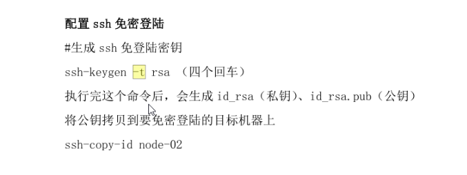

## centos6网络设置
```
ip信息：  ip address  
网络主机绑定IP地址：/etc/hosts

查看所有网卡设备的信息
命令：cat /etc/udev/rules.d/70-persistent-net.rules
解析:SUBSYSTEM=="net", ACTION=="add", DRIVERS=="?*", ATTR{address}="00:15:5d:38:67:03", ATTR{type}=="1",KERNEL=="eth*", NAME="eth0"

查看指定网卡配置信息:
命令：cat /etc/sysconfig/network-scripts/ifcfg-eth0
解析：ifcfg-[网卡设备名称] 对应网卡设备信息里面的NAME,比如eth0,eth1
DEVICE=eth0 //对于网卡设备的NAME
HWADDR=00:15:5D:38:67:03 //对于网卡设备的ATTR{address}
TYPE=Ethernet
ONBOOT=yes //这个默认是no,表示开机不启用该网卡
NM_CONTROLLED=yes
BOOTPROTO=dhcp
```
## centos7网络设置
```
使用nmtui管理
命令（tui形式）：  nmtui  
对应的网卡配置文件：/etc/sysconfig/network-scripts/ifcfg-ens33
网卡命名规则：
en： ethernet以太网卡
o：主板集成网卡
p：PCI独立网卡
s：热插拔网卡
nnn数字：MAC+主板信息（生产唯一序号）
如：ifcfg-ens33 （以太热插拔）
DNS配置文件:/etc/resolv.conf
ifconfig    ping  地址  -c次数      nslookup www.baidu.com
```
## centos常用命令
```
计算机名：/etc/hostname
内存使用情况: free -m  
cpu使用情况: top   
磁盘以及分区情况:  df -h   
查看指定端口被使用情况: lsof -i:端口号     
				netstat -apn|grep 端口号 
				ps -au|grep 端口号
查看指定命令对应程序所在的位置(等价于cmd的where)：which
查询当前系统的版本:uname -r
当前所在的位置:pwd(printf working directory) 
帮助文档 man man
输出指定的字符:echo $PATH      
$后面跟一个变量
立刻关机:halt 
立刻关机:poweroff 
立刻关机(root用户使用):shutdown -h now 
立刻重启(root用户使用):shutdown -r now 
windows的关机:shutdown -s -t 0 
```
## centos文件和目录
```
系统目录说明
/bin 命令对应的执行程序
/dev    设备被抽象成文件
/etc    系统的配置文件，第三方程序的配置信息
/home   所有用户的目录
/lib    动态类库，
/media  自动挂载
/mnt    手动挂在
/root   管理员的一个目录
/usr    当前用户的软件安装目录

相关命令
scp(super copy  基于ssh)
挂载 mount  挂载U盘，挂载FTP
ls -a列出所有  -l详细信息 -R递归子目录
创建目录 mkdir aa/bb/cc -p表示多级目录
创建文件    touch
删除目录 rmdir 只能删除空目录
删除目录或者文件    rm -r表示递归
复制命令 cp 源文件/目录 目标文件/目录    -r递归操作（目录情况下）
查看文件内容    cat more    less    head    tail
修改文件名/文件夹名  mv 源路径 目标路径
创建软链接（快捷方式，指向一个硬链接）    ln -s 源文件/源目录    目标路径
创建硬链接（并不占用磁盘空间，链接到磁盘地址） ln 源文件 目标路径
硬链接相关，查看Inode   stat 文件
文件或目录属性  wc 查看文本文件的行数，单词书，字节数   od 查看二进制文件
du -h   查看目录占用
文件的查找和检索，按文件属性    find 路径 -name（按名称查） 文件名称  (通配符*一个或多个字符，?一个字符) -size(按大小查找) + 10k(大于10k) - 10M（小于10M）  如果按大小范围就用两个size -type(安装文件类型查)
文件的查找和检索，按照文件内容  grep -r递归 "查找内容" "查找路径"
文件详细信息解释  d(文件类型)rwx(所有者权限)r-x(所在组权限)r-x(其他用户权限)  7（硬链接数量）  root(所属用户) root(所在的组) 4096（大小）   
drwxr-xr-x. 7 root   root      4096 Jul  3  2018 dotnet
文件类型    普通文件-   目录d   链接符号l   块设备b 字符设备c   socket文件s 管道p
修改文件权限 chmod  777 文件或者目录
修改所在的组    chown 文件所有者【：文件所属组】 文件或者目录

压缩和解压缩
简易版 gzip *.txt ,gunzip a.txt.gz .gz格式的压缩包;  bzip2 .bz2格式压缩包
高阶版 tar zcvf xxx.tar.gz *.txt  jcvf xxx.tar.bz2 *.txt  参数解释：c压缩 x解压缩 v显示提示信息 f指定压缩文件的名字 z使用gz的方式压缩 j使用bzip2方式压缩 -C压缩到指定目录，解压缩到指定目录 默认到当前目录
```
## centos进程管理
```
ps a 当前操作系统的所有用户 u显示用户自己的信息 x没有终端的应用程序 ps aux | grep bash 利用管道检索指定的进程
who 查看当前用户 tty1-tty6文字终端 tty7带桌面的终端 ctrl+alt+f1-f7进行切换 pts/0设备终端
kill 结束进程 -信号 -pid -l列出所有信号
env 环境变量 env | grep PATH
top 任务管理器  
```
## centos服务管理
```
chkconfig --list 列出所有的服务
chkconfig  服务名称	[on/off]开机启动/开机不启动
service 服务名成 [start/stop/restart]
systemctl //列出正在运行的服务
systemctl list-unit-files //所有已经安装的服务
systemd-cgls   以树形列出正在运行的进程，它可以递归显示控制组内容
systemctl start postfix.service  启动一个服务
systemctl stop postfix.service	停止
systemctl restart postfix.service	重启
systemctl status postfix.service	查看服务的状态
systemctl enable postfix.service	设置开机启动
systemctl disable postfix.service	设置开机不启动
systemctl is-enabled postfix.service	查看是否开机启动
```
## centos用户管理
```
创建用户 adduser 用户名     --这个本质是个脚本，后续会提示设置密码等步骤，非常方便
创建用户    useradd  很多参数
删除用户    deluser 用户名
删除用户    userdel -r 用户名   --这个会把用户对于的桌面文件夹删掉
添加用户组  groupadd 组名
修改密码    passwd  用户名
直接切换用户 su 用户名    
查看所有的用户  利用配置文件查看    /etc/passwd
ssh 用户名@ip 基于服务器openssh-server
logout  登出
```
## centos环境变量
```
临时修改某个键的值 export LD_LIBRARY_PATH=./lib
export PATH="/tmp:$PATH"  //这个的意思是，重新给环境变量的PATH赋值，$PATH表示原来的PATH值，PATH值用:分割
永久修改环境变量的值 
	第一步，修改文件/etc/profile，在末尾加上行 PATH="/tmp:$PATH"，
	第二步，source /etc/profile 
```
## centos局域网共享
```
局域网共享yum install samba --downloadonly --downloaddir ./download
映射网络驱动器 mount -t cifs -o username="administrator",password="xxx" //192.168.56.101/Downloads /LFIS_Release
挂载windows的共享 使用smbfs文件系统 mount -t smbfs -o username=xxx,password=xxx,-l //192.168.56.1/Downloads /mnt/hostDownloads
挂载windows的共享 使用cifs文件系统 mount -t cifs -o username="xxx",password="xxx" //192.168.56.1/Downloads /mnt/Downloads/ 
安装文件系统 install cifs-utils
重启系统的时候自动mount, 将下面命令行添加到/etc/fstab里。
//192.168.56.1/Downloads /mnt/downloads/ cifs defaults,username=Deroom,password=BT151 0 2 
```
## yum教程
```
yum info mysql* available  //查询可用的程序
yum list installed  //查看所有已经安装的程序  
yum  localinstall docker-engine-selinux-1.12.6-1.el7.centos.noarch.rpm  --nogpgcheck  //本地安装
yum  localinstall docker-engine-1.12.6-1.el7.centos.x86_64.rpm --nogpgcheck
yum grouplist //列出所有的软件组 比如 genome desktop
yum group install 某个组的名称 //安装某个组的程序，一系列程序
yum --downloadonly --downloaddir ./download  //把指定的软件下载到本机目录，不进行安装 试用单个程序或者组
```
## centos安装桌面
```
命令： yum groupinstall Desktop X Window System Chinese Surport
```
## centos-jdk
```
yum install java-1.8.0-openjdk-devel.x86_64 --downloadonly --downloaddir /root/jdk1.8
yum install java-11-openjdk-devel.x86_64 --downloadonly --downloaddir /root/jdk11
```
## docker基本命令：
```
docker -v //查看版本
docker info //查看信息
```
## docker镜像操作
```
docker pull 镜像名称 //获取镜像，镜像名称=名称:tag
docker tag 名称:tag 名称:新tag //修改镜像的tag
docker rmi 镜像ID //删除镜像
docker images //列出所有的镜像
docker load：导入本地镜像
docker load [OPTIONS]
-i：从tar文件读取
-q：禁止读入输出
例如：docker load -i mytomcat_v1.tar
docker load < /root/wch/mytomcat_v1.tar
docker push //上次镜像
```
## docker镜像仓库
```
公网镜像仓库，dockerhub
私网镜像仓库
公有仓库：客户端上传需要登陆仓库，下载不需要登陆
私有仓库：客户端上传与下载都要登陆仓库
docker login //登陆仓库
从dockerhub下载的公开镜像不能直接上传到私网镜像，需要重新tag,然后上传
Harbor可以快速搭建一个企业级的镜像仓库
修改linux的主机名称，hostnamectl set-hostname 主机名称
安装docker-compose,docker官方在单台机器的编排工具，1.24.1
docker-compose down //停止本机的doker 容器
docker rmi `docker images -aq`//linux执行符号，
docker push centos:7.6 
配置docker不走https,vi /etc/docker/daemon.json  "insecure-registries":["192.168.56.104"]
docker tag centos:7.6 192.168.56.104/library/centos:7.6
docker push 192.168.56.104/library/centos:7.6
docker login 仓库ip
```
## docker容器操作
```
docker create 镜像名 //新增容器
docker rm 容器ID //删除容器
docker run 参数
--name 自定义容器名称
-d 容器后台运行
-p 当前系统端口：容器端口 端口映射（容器内部端口映射外部）
-v 当前系统目录：容器目录 目录映射
例子：docker run -it --name 容器名称 repository:tag /bin/bash //以交互方式启动
docker exec -i -t 通过docker ps查看的name名 /bin/bash
// 停止所有容器
docker ps -a | grep "Exited" | awk '{print $1 }'|xargs docker stop
// 删除所有停止的容器
docker ps -a | grep "Exited" | awk '{print $1 }'|xargs docker rm
// 删除所有tag标签是none的镜像
docker images|grep none|awk '{print $3 }'|xargs docker rmi
```
## docker客户端教程
```
Docker服务端提供RestfulAPI，默认不允许远程访问，所以需要修改服务端配置
服务端开放TCP连接的方法
修改/etc/docker/daemon.json，没有就新增
内容：{"hosts":[ "unix:///var/run/docker.sock", "tcp://0.0.0.0:2375" ]}
重启服务或者服务器，查看2375端口是否开放，ss -l |grep -Po '\s[^\s]*2375\s'
客户端连接服务端：docker -H tcp://192.168.56.101:2375 version
docker -H 192.168.56.101:2375 version
客户端每次运行都需要指定 -H tcp://192.168.137.21:2375,比较麻烦，可以通过：export DOCKER_HOST="tcp://192.168.137.21:2375" 建立一个环境变量
windows环境下 cmd 使用 set DOCKER_HOST=tcp://192.168.56.101:2375
连接成功，可以运行： docker info 查看远程docker的信息
```
## docker-machine
```
安装dockertoolbox就有docker客户端和dockermachine
帮助：docker-machine -h
可以再各个命令后面再接-h查看详细的参数说明
查看已注册的docker服务端：docker-machine ls
创建或者注册docker服务端，根据driver:
场景：centos7，自己安装了docker1.12,只是为了把该docker添加到windows下docker-machine列表，方便管理
添加已有（docker安装后不要配置systemd的开机启动，否则machine重新配置docker的时候会冲突）：	docker-machine create  --driver generic --generic-ip-address 192.168.56.101  machine名称（自定义）
新建和添加已有的命令是一样的
使用PS,执行：docker-machine env machine名称，会得到一个执行命令
 docker-machine env yt | Invoke-Expression
 执行后,在windows上执行docker命令等价于在centos上执行，类似于docker -H 192.168.56.101:2375
移除machine:docker-machine rm
```
## doker部署netcore程序
1. `设定dockfile文件为编译输出`
```
修改项目文件，增加一行：<None Include="Dockerfile" CopyToPublishDirectory="Always" />
目的：dockerfile文件始终复制到发布后的目录
```
1. 在windows环境下publish项目
```
dotnet publish  //用这个就可以，为当前目录中的项目创建一个 依赖于运行时的跨平台二进制文件：
交叉编译:发布到linux64 dotnet 命令为：dotnet publish -r linux-x64 //不需要这样编译
```
1. 在windows的docker客户端build镜像
```
命令： docker build -t 镜像名称 Dockerfile所在的路径
例如：docker build -t wch .\bin\Debug\netcoreapp2.0\publish\
Dockerfile内容：
FROM microsoft/aspnetcore:2.0
#指定一个workdir，目录随便
WORKDIR /app
#把相对dockerfile所在目录的相对路径的文件 复制到 workdir相对路径的位置
COPY . .
#声明系统运行需要用到的端口，只是声明，方便创建容器的人知道需要处理哪些端口映射
expose 80
#等价于cmd的dotnet命令 
ENTRYPOINT ["dotnet", "Azeroth.Klz.dll"]
```
1. 在windows的docker客户端run一个容器
```
docker run -it --rm -p 容器外部端口:容器内部端口 --name 容器名称 镜像名称
docker run -it --rm -p 5000:80 --name wch123 wch
```
1. 访问容器所在的linux的地址
```
http://192.168.56.101:5000/api/values
```
1. 制作bat脚本
```
步骤总结为：发布程序，build镜像，创建容器及运行，删掉tag是none的镜像（也就是老版本的镜像）
脚步内容：
dotnet publish
docker build -t wch .\bin\Debug\netcoreapp2.0\publish\
docker stop wch123
docker rm wch123
docker run -d -it --rm -p 5000:80 --name wch123 wch
docker images|grep none|awk '{print $3 }'|xargs docker rmi
```
1. 微软文档[FAQ:](https://docs.microsoft.com/zh-cn/dotnet/core/tools/dotnet-publish)

## hadoop部署模式
### 
## hadoop搭建集群
```
vbox新建三台机器后，centos7会自动配置网卡，比centos6方便，centos6需要更新网卡配置文件里的mac地址才能访问网络
准备三台机器，hadoopNameNode,hadoopDataNode1,hadoopNameNode2
修改机器的名称 /etc/hostname
修改机器的hosts文件 /etc/hosts
安装jdk1.8，yum localinstall以后不会设置环境变量，因为已经配置的PATH，所有可以直接运行java和javac，但是仍然需要设置相关环境变量，其他程序依赖这个这几个环境变量的值
JDK全局环境变量配置
export JAVA_HOME=/usr/java/jdk1.8.0_231-amd64
export CLASSPATH=.:$JAVA_HOME/lib/dt.jar:$JAVA_HOME/lib/tools.jar
export PATH=$PATH:$JAVA_HOME/bin
把hadoop安装程序上传到hadoopNameNode ，目录/export/server/,直接解压到当前目录，tar zxvf hadoop-2.7.4.tar.gz
配置文件修改
/export/server/hadoop2.7.4/etc/hadoop//hadoop-env.sh，找到 export JAVA_HOME={JAVA_HOME}，修改为export JAVA_HOME=/usr/java/jdk1.8.0_231-amd64
/export/server/hadoop2.7.4/etc/hadoop/core-site.xml，
<configuration>
	<property>
		<name>fs.defaultFS</name>
		<value>hdfs://hadoopNameNode:9000</value>
	</property>
	<property>
		<name>hadoop.tmp.dir</name>
		<value>/home/hadoop2.7.4_data</value>
	</property>
</configuration>

hdfs-site.xml，
<configuration>
	<property>
		<name>dfs.replication</name>
		<value>2</value>
	</property>
	<property>
		<name>dfs.namenode.secondary.http-address</name>
		<value>hadoopDataNode1:50090</value>
	</property>
</configuration>

mv mapred-site.xml.template mapred-site.xml
<configuration>
	<property>
		<name>mapreduce.framework.name</name>
		<value>yarn</value>
	</property>
</configuration>

yarn-site.xml
<configuration>
	<property>
		<name>yarn.resourcemanager.hostname</name>
		<value>hadoopNameNode</value>
	</property>
	<property>
		<name>yarn.nodemanager.aux-services</name>
		<value>mapreduce_shuffle</value>
	</property>
</configuration>

slaves
hadoopNameNode
hadoopDataNode1
hadoopDataNode2

把hadoop的程序路径配置到环境变量
export HADOOP_HOME=/export/server/hadoop2.7.4
export PATH=$PATH:$HADOOP_HOME/bin:$HADOOP_HOME/sbin

虚拟机内存不要低于2048，512和1024MB的情况下，hadoop可以正常启动起来，但是执行demo程序，resourcemanager就出错终止运行了

下发配置好的文件到其他机器 scp -r /export/server/hadoop2.7.4 root@hadoopDataNode1:/export/server/hadoop2.7.4/
scp -r /export/server/hadoop2.7.4 root@hadoopDataNode2:/export/server/hadoop2.7.4/
下发环境变量配置文件
scp -r /etc/profile root@hadoopDataNode2:/etc/
scp -r /etc/profile root@hadoopDataNode1:/etc/

刷新环境变量 source /etc/profile

配置文件说明
***-default.xml 这里面配置了hadoop默认的配置选项
如果用户没有修改，那么这里面的选项将会生效
***-site.xml 这里面配置了用户需要自定义的配置选项
site中配置的值优先级大于default中的配置项的值
```
## HDFS ON Windows
```
windows下搭建HDFS，不依赖cygwin，
解压hadoop的tar.gz包，使用管理员权限解压
找到对应的hadoop-winutils,按照对应的说明进行替换
增加环境变量，HADOOP_HOME
增加/bin和/sbin到PATH，方便后续执行命令
涉及的命令，hdfs.cmd,start-hdfs.cmd
如果环境变量配置的jdk不是1.8，修改etc\hadoop\hadoop-env.cmd文件，设置JAVA_HOME为1.8版本的jdk
修改配置文件:conf/hadoop-site.xml:
<configuration>
	<property>
    <name>fs.default.name</name>
    <value>hdfs://localhost:9000/</value>
  </property>
  <property>
    <name>mapred.job.tracker</name>
    <value>localhost:9001</value>
  </property>
  <property>
    <name>dfs.replication</name>
    <value>1</value>
  </property>
  <property>
		<name>hadoop.tmp.dir</name>
		<value>file:/D:/01Tools/hadoopdata</value>
  </property>
</configuration>
修改配置文件：hdfs-site.xml
<configuration>
	<property>
		<name>dfs.namenode.name.dir</name>
		<value>file:/D:/01Tools/hadoopdata/namenode</value>
	</property>
	<property>
		<name>dfs.datanode.data.dir</name>
		<value>file:/D:/01Tools/hadoopdata/datanode</value>
	</property>
</configuration>
格式化文件系统：hdfs namenode -format
启动HDFS文件系统：start-dfs.cmd
停止HDFS文件系统：stop-dfs.cmd
查看HDFS系统的信息：http://localhost:50070
创建目录：hdfs dfs -mkdir -p hdfs://localhost:9000/a/b/c
上传文件：hdfs dfs -put d:\wifi密码.txt hdfs://localhost:9000/a/b/c/
其它操作：hdfs查看帮助

把start-dfs.cmd安装为windows服务：
复制srvany.exe到D:\01Tools\hadoop-2.7.1;
执行：instsrv.exe apache_HDFS D:\01Tools\hadoop-2.7.1\srvany.exe；
修改注册表：HKEY_LOCAL_MACHINE\SYSTEM\CurrentControlSet\Services\apache_HDFS
增加项：Parameters
增加字符串：Application=D:\01Tools\hadoop-2.7.1\sbin\start-dfs.cmd
AppParameters=
AppDirectory=D:\01Tools\hadoop-2.7.1\sbin\
```
## hadoop运行和调试
```
启动hadoop集群，需要启动HDFS集群，YARN集群
首次启动HDFS集群，需要对其进行格式化（初始化），格式化只能进行一次，和yarn没有关系,集群启动成功以后，不要再进行格式化
在namenode所在的机器上进行hdfs格式化
格式化命令：hdfs namenode -format，执行后需要等待

脚本启动hdfs集群，也可以单点一个个启动，
前提条件，namenode到其他机器免密登陆，配置文件slaves配置好了
脚本：/export/server/hadoop2.7.4/sbin/start-dfs.sh，也有配套的停止脚本
脚本启动yarn集群
脚本：/export/server/hadoop2.7.4/sbin/start-yarn.sh

查看状态 jps
单节点逐个启动
集群启动成功后，提供web查看[http://192.168.56.61:50070](http://192.168.56.61:50070)[http://192.168.56.61:8088](http://192.168.56.61:8088)

执行一个mapreduce
hadoop jar  hadoop-mapreduce-examples-2.7.4.jar pi 20 50
```
## windows局域网共享
```
映射网络上共享目录到指定盘符：net use Z: \\192.168.56.1\Downloads BT151 /user:Deroom
做成bat,然后开机启动，修改注册表，位置：HKEY_LOCAL_MACHINE\SOFTWARE\Microsoft\Windows\CurrentVersion\Run
类似于："diskZ"="C:\\Users\\Administrator\\diskZ.bat"
删除指定的映射	net use Z: /del 
```
## windows环境变量
```
通过注册表修改环境变量，位置：HKEY_LOCAL_MACHINE\SYSTEM\CurrentControlSet\Control\Session Manager\Environment

临时设置环境变量
查看所有环境变量 ls env:
查看某个环境变量 ls env:path
设置某个值 $Env:path=$Env:Path+";C:\Go\bin"

永久设置环境变量
set pp=%PATH%
setx PATH 
```
## windows常用命令
```
列出指定目录下的所有文件（包含子目录）的完整路径：dir /s /b
查看访问到指定网络地址经过的网络节点：tracert 地址
获取windows服务的名称列表：
sc query state=all |findstr /s /i /m "\<SERVICE_NAME:" >d:/scnamelist.txt
taskmgr --查看进程、服务等
regedit--修改各种配置信息
msinfo32--查看磁盘等信息
sconfig --工具集合，修改计算机名称等
重启 shutdown -r -t 0
关机 shutdown -s -t 0
查看磁盘容量：先使用diskpart命令，进入交互模式，再使用list disk命令即可。
交互模式下输入？可以查看帮助信息

禁用虚拟内存：HKEY_LOCAL_MACHINE\SYSTEM\CurrentControlSet\Control\Session Manager\Memory Management\DisablePagingExecutive 设置为1
删除或者设置虚拟内存文件，步骤：
	先wmic进入交互模式（必须），然后
	computersystem where name="TP20201225" set AutomaticManagedPagefile=False
	重启后
	PageFileSet where "name='C:\\pagefile.sys'" delete
禁用休眠，powercfg -h off 重启后生效，会自动删除休眠文件
关闭防火墙，
netsh firewall set opmode disable
netsh advfirewall firewall set opmode disable

设定update服务为手动启动，关闭默认共享，关闭自动播放等
修改注册表HKEY_LOCAL_MACHINE\SYSTEM\CurrentControlSet\services\wuauserv
Start=3

计算机管理-远程
	管理机配置凭据，windows和普通凭据，具体用哪个地方的待研究，
	计算机管理连接192.168.56.101，就可以进行管理
```
## windows解压缩
```
安装7z,下载命令行版本,然后修改环境变量，把7za.exe加入到PATH
压缩：7za a 压缩包全名称含路径 源文件路径
默认为7z格式，参数最少，比如：7za a wode.7z d:/dcq   
指定zip,比如：7za a -tzip a wode.zip d:/dcq
压缩的文件移除根目录级：7za a -r wode.7z d:/dcq
解压缩：7za x 压缩包全路径 -o目标文件夹
解压缩比如：7za x d:/abc/wode.7z -od:/目标
```
## win2008r2core配置网站服务
```
打开WoW64：Start /w ocsetup ServerCore-WOW64
打开.NET2.0层：Start /w ocsetup NetFx2-ServerCore
打开.NET2.0层的WoW64: Start /w ocsetup NetFx2-ServerCore-WOW64
安装IIS
	dism /online /enable-feature /featurename:IIS-WebServerRole
    dism /online /enable-feature /featurename:IIS-ISAPIFilter
    dism /online /enable-feature /featurename:IIS-ISAPIExtensions
    dism /online /enable-feature /featurename:IIS-NetFxExtensibility
安装IIS-ASPNET
    dism /online /enable-feature /featurename:IIS-ASPNET
net462的前置补丁：windows6.1-kb4474419-v3-x64_.msu，net462的签名验证，新软件的签名验证
Windows6.1-KB2999226-x64.msu  解决安装vc++2015
vc++2012 2013 2015
NDP462-DevPack-KB3151934-ENU.exe或者dotNetFx45_Full_x86_x64.exe
安装servercore版net40或者net462或者net45
安装PS DISM /Online /Enable-Feature /FeatureName:MicrosoftWindowsPowerShell 
升级到ps3.0 依赖net40 或者ps4.0依赖net45
```
## iis和appcmd
```
c:\windows\system32\inetsrv\appcmd.exe
总的命令格式：APPCMD (命令) (对象类型) <标识符> </参数1:值1 ...>
删除虚拟目录：
appcmd delete vdir 虚拟路径
查看所有的参数：appcmd list sites /text:*
appcmd list apppool /text:*
修改网站的应用程序池
appcmd set site "Default web site" -[path='/'].applicationPool:"ASP.NET v4.0"
查看某个对象的操作参数
appcmd set site "Default web site" /?
appcmd可以配置iis应用程序池和iis应用程序的所有参数，从配置文件导入新程序池或者新站点，修改配置，等等操作
所有参数结合2个配置文件可以得出
C:\Windows\System32\inetsrv\config\applicationHost.config,这个实际起作用的配置文件，iis运行时的配置文件继承这个，再结合用户的web.config
C:\Windows\System32\inetsrv\config\schema\IIS_schema.xml,这个文件是配置文件的元数据，所有的参数的名称和类型都可以查，特别是枚举类型，技巧：通过开发机图像界面配置iis，然后appcmd导出xml，然后作为脚本的一部分,在部署环境利用appcm导入xml里面的配置
```
## windows-MSBuild
```
.netframework包含完整的msbuild程序
配置环境变量，增加path,C:\Windows\Microsoft.NET\Framework64\v4.0.30319
msbuild不依赖visual studio
vs调用msbuild编译项目，并且vs按照项目类别把各类别对应的一些编译参数放在配置文件中，位置在：C:\Program Files (x86)\MSBuild，只有安装了vs才会有，在开发机上复制这个目录下的文件到server2008R2Core的同样位置。
调用msbuild的编译命令为：msbuild 解决方案.sln/项目.csproj 参数的配置文件。例如：msbuild JenkinsDemo.sln /p:VisualStudioVersion=14.0
如果复制的是vs2015的配置，参数为/p:VisualStudioVersion=14.0，这个参数会去C:\Program Files (x86)\MSBuild\Microsoft\VisualStudio\v14.0下面找
如果参数为/p:VisualStudioVersion=11.0，就会去C:\Program Files (x86)\MSBuild\Microsoft\VisualStudio\v11.0下面找
对应关系为：
	vs2010===11.0
	vs2012===12.0
	vs2015===14.0
调用msbuild的发布命令为：msbuild Mytech.csproj /p:DeployOnBuild=true /p:PublishProfile=uk001.pubxml /p:VisualStudioVersion=14.0
7z打包
执行scp把分发到远程机器
执行远程机器的ps脚本,执行后续的部署等操作
```
## Windows-ssh(openssh)
1. 安装
```
创建目录C:\Program Files\OpenSSH，想办法把文件放进去，win10，加载vhd，然后复制进去，或者打开宿主共享，然后复制
顺便安装7za,把7za.exe,7za.dll,7zxa.dll放到system32目录
切到OpenSSh目录
powershell.exe -ExecutionPolicy Bypass -File install-sshd.ps1
显示3行成功
如果启用了防火墙，则
netsh advfirewall firewall add rule name=sshd dir=in action=allow protocol=TCP localport=22
设定服务自动启动
Set-Service sshd -StartupType Automatic
```
2. 免密登录
```
配置免密登陆，场景：A免密登陆B，
B作为服务端，要修改sshd_config（不是ssh_config）文件，
	修改B中C:/ProgramData/ssh/sshd_config，注释掉2行，默认是在最后
	Match Group administrators
		AuthorizedKeysFile __PROGRAMDATA__/ssh/administrators_authorized_keys
	重启B的ssh和sshagent服务
	Centos7的为/etc/ssh/sshd_config，修改内容，默认情况这三行为注释掉的，只需要取消注释，按如下设置即可
	RSAAuthentication yes
	PubkeyAuthentication yes
	AuthorizedKeysFile	.ssh/authorized_keys
A作为客户端，要做的事情为：
A使用ssh-keygen生成公钥和私钥，参数全部默认，一路回车，在当前用户目录下的.ssh目录里面id_rsa，id_rsa.pub
打开id_rsa.pub复制里面的内容，追加到B的authorized_keys文件，文件位置为【用户名/.ssh/authorized_keys】 比如Administrator/.ssh/authorized_keys
centos:.ssh目录的权限为700，其下文件authorized_keys和私钥的权限为600,这是linux的安全要求，如果权限不对，自动登录将不会生效,
如果authorized_keys文件不存在就新建,
这里是把authorized_keys放在Administrator用户下，后续免密登陆就是使用Administrator用户，命令为：ssh Administrator@被免密登陆的机器IP
A上执行：ssh Administratro@192.168.56.101
```

3. ssh登陆卡
```
修改服务端的sshd_config（不是ssh_config），设置为如下：
UseDNS no
GSSAPIAuthentication no
```

## win2008r2Core配置sqlserver
```
在servercore2008R2中不能打开sqlserver的服务管理器,需要编辑注册表值来修改sqlserver服务的配置
配置sqlserverexpress，允许客户端通过tcp连接服务端，固定监听tcp1433端口
	修改注册表：HKEY_LOCAL_MACHINE\SOFTWARE\Wow6432Node\Microsoft\Microsoft SQL Server\MSSQL10.QLEXPRESS\MSSQLServer\SuperSocketNetLib\Tcp
	"Enabled"=dword:00000001
	"ListenOnAllIPs"=dword:00000001
	HKEY_LOCAL_MACHINE\SOFTWARE\Wow6432Node\Microsoft\Microsoft SQL Server\MSSQL10.QLEXPRESS\MSSQLServer\SuperSocketNetLib\Tcp\IPAll
	"TcpPort"="1433"
特别注意：32位的安装程序安装到64位，注册表要修改Wow6432Node下的。64位安装程序到64位系统则不用Wow6432Node，32位安装程序到32位系统也不用Wow6432Node
登陆：BT@151
数据库：123456
配置数据库允许sqlserver认证，安装的时候如果没有选择允许，命令行sql登陆，执行相应的sql语句，允许sa登录
在数据库所在机器使用sqlcmd连接数据库，然后执行sql语句，允许sa账号登陆
配置自动开启SQLBrowser，重启生效。这个服务监听udp1434。配合sqlserver服务的动态端口监听，
HKEY_LOCAL_MACHINE\SYSTEM\CurrentControlSet\services\SQLBrowser
Start=2
```
## windows-jdk
```
安装java的sdk
使用解压缩版文件，非安装版，winscp上传到指定目录
使用7za解压缩到c:/dw
配置环境变量，重启生效
HKEY_LOCAL_MACHINE\SYSTEM\CurrentControlSet\Control\Session Manager\Environment
JAVA_HOME=C:\dw\jdk-11.0.2
增加path的值
```
## windows-jenkins
```
安装jenkins，把jenkins.war放到tomcat的webapps目录下，重启服务
net stop Tomcat9
net start Tomcat9
安装jenkins
war文件
安装后amdin在用户管理修改密码
如果忘记admin的密码
打开/C:/Windows/ServiceProfiles/LocalService/.jenkins/users/admin/config.xml,找到密码部分， 修改为#jbcrypt:$2a$10$MiIVR0rr/UhQBqT.bBq0QehTiQVqgNpUGyWW2nJObaVAM/2xSQdSq
然后重启，使用123456登陆
插件相关
插件》高级》修改插件源的地址，使用https://mirrors.huaweicloud.com/jenkins/updates/update-center.json
```
## Windows疑难杂症
1. ie打不开
```
修改注册表权限，HKEY_CURRENT_USER\Software\Microsoft\Internet Explorer\Main右键点击Main，选择权限，启用继承
```
1. firefox关联windows证书管理器
```
进入about:config页面，找到security.enterprise_roots.enabled，把值改成true
```
1. 声音或者网卡等名称被加上数字1、2结尾
```
进入设备管理器，重点：显示隐藏设备，把设备对应的隐藏和非隐藏都删掉，然后重启电脑解决
```

## git教程
```
安装git,华为镜像站下载Git-2.21.0-64-bit.tar.bz2
放在c:/dw，解压缩，设置环境变量C:\dw\Git-2.21.0-64-bit\bin

查看仓库已经关联的所有远程地址：git remote
增加一个远程地址：git remote add 本地显示名称 远程地址

查看当前的所有分支：git branch --all
查看当前的所有分支的关联：git branch -vv
删除本地分支：git branch -d 分支名称
签出分支：git checkout -b 本地显示名称 远程名称/分支
切换分支：git checkout 分支名称
重新设置本地分支的上游分支：git branch -u 远程名称/分支

获取远程分支信息：git fetch 远程名称
获取并且合并到本地当前分支：git pull 远程名称

查看提交记录：git log
重置当前点：git reset 提交id

回退到某次提交的操作：git reset --hard 提交id
然后：git push -f 远程仓库名称 本地分支名称
确保远程上的分支名称和本地当前分支名称一致；如果不一致，执行（git push -f 远程仓库名称 远程分支名称）会失败；执行（git push -f 远程仓库名称 本地分支名称）会导致远程仓库创建新的分支；
待研究正确使用方法

把改动提交到暂存区：git add 文件名称；*表示所有改动的文件
提交修改到本地仓：git commit -am 备注说明
可以不暂存，直接提交到本地仓

推送到远程分支：git push 远程名称 本地分支

github使用ssh方式提示time out的解决办法
可能原因：网络某个节点禁止了22端口，比如某云
解决：尝试使用443端口进行ssh,检测可行性的命令：ssh -T -p 443 git@ssh.github.com
如果可行，在当前用户目录下的.ssh目录下建立一个config文件，普通文本格式
内容：
Host github.com
Hostname ssh.github.com
Port 443

重新打开ssh的bash,进行ssh操作

github的ssh方式的地址：git@github.com:eeroom/Azeroth.Core.git
git@github.com:eeroom/hz.foundation.git
git@github.com:adoconnection/SevenZipExtractor.git
```
## windows-activemq
```
安装windows服务的方法，下载解压版，比如：apache-activemq-5.15.10-bin.zip
解压，切换到目录bin/win64，管理员运行cmd,执行：InstallService.bat，卸载：UninstallService.bat
验证安装是否ok:打开http://localhost:8161/admin，用户名：admin,密码：admin
配置文件说明：

异步消息的两类模型
点对点消息模型（消息队列），每个消息只有一个接收者可以取到，可以有多个接受者
发布订阅消息模型，消息被发送到一个主题，主题所有订阅者都可以取到消息，可以有多个接收者
```
## windows-mariadb
```
安装windows服务的方法，下载解压版，比如：mariadb-10.2.26-winx64.zip
解压，切换到目录bin/，管理员运行cmd,
tips:确保存放数据的目录的上级目录已经创建ok，这里需要d:\已存在，但是d:\mariadb-data不存在
创建数据库实例：mysql_install_db.exe --datadir=d:\mariadb-data --service=mariadb_001 --password=123456
这个命令会自动在数据目录下创建配置文件my.ini
删除数据库实例：停止服务，删除对应的服务，删除数据目录
sc delete mariadb_hzducha
验证安装是否ok:使用客户端连接测试
配置文件和mysql_install_db.exe参数说明：
```
### 
## windows-tomcat
```
安装tomcat9
解压到目录：c:/dw
配置环境变量，重启
CLASS_PATH=.;%JAVA_HOME%\lib;
CATALINA_HOME=C:\dw\apache-tomcat-9.0.39
到tomcat的bin目录，执行：service.bat install
把服务设定为开机启动
HKEY_LOCAL_MACHINE\SYSTEM\CurrentControlSet\services\Tomcat9
Start=2
start值得说明：0 引导；1 系统；2 自动；3 手动；4 禁用 
或者Set-Service Tomcat9 -StartupType Automatic
启动服务net start Tomcat9
测试,打开：http://192.168.56.101:8080,
```
## windows-redis
```
修改配置文件redis.windows.conf ，设置密码：requirepass 123456
安装：redis-server.exe --service-install redis.windows-service --service-name redisserver1 --loglevel verbose
卸载：redis-server.exe  --service-uninstall--service-name redisserver1
客户端：redis-cli.exe -h 127.0.0.1 -p 6379 -a 123456
```
## powershell教程
```
定义变量：$变量名称
定义强类型变量：[类型名称]$变量名称
全局变量：
$ErrorActionPreference="Stop" 遇到异常停止执行,需要在脚步第一行
$null 等价于c#的null
$PSVersionTable 查看ps的版本信息
小技巧：使用ps配套的ISE工具,在命令界面输入$,工具会自动列出所有的全局变量列表,获取环境变量、宿主机等信息非常方便

比较运算符不能直接使用==,<,>等等，需要使用对应的字符版
==	-eq
!=	-ne
大于	-gt
大于等于	-ge
小于	-lt
小于等于	-le
包含	-contains
不包含	-notcontains

分支语句和c#一致，注意变量名称即可

循环语句和c#大体一致，其中while完全一致，for和foreach有细微差别，注意变量名称即可，
差别：不要变量的类型声明，如果需要强类型变量，在foreach语句外声明
foreach($tmp in $lst){}
或者
[string]$tmp
foreach($tmp in $lst){}
for语句同理

引入程序集：Add-Type -Path "类库全路径"
使用c#类型，
构造函数：[类型全名称]::new(参数1,参数2,,,)
静态方法：[类型全名称]::方法名称(参数1,参数2,,,)
实例方法：实例.方法名称(参数1,参数2,,,)

可以直接执行第三方的exe,比如cmd里常用的命令，用法，exe的全路径 参数....

控制台输入直接使用c#的
控制台输出可以使用c#的，或者write-host

ps5.1版本后可以支持class关键字，脚步里面直接定义class，具体用法参照《https请求-双向认证.ps1》

```
## bat教程
```
参数：%0为第0个参数，值是bat文件本身，%1为第一个参数，为调用命令的时候传入的，例如：test.bat rt		则%1的值为rt,第2个参数类推
参数扩展：~扩展指令；d:
```
## SSMS(sqlserver management studio)
```
指定事务隔离级别：SET TRANSACTION ISOLATION LEVEL READ UNCOMMITTED
隔离级别包含：READ UNCOMMITTED、READ COMMITTED

todo    事务、事务隔离级别、锁的区别和关系，update锁，insert锁

设置隐式事务：SET IMPLICIT_TRANSACTIONS ON

移除登陆窗口缓存的账号和密码，账号和密码数据保存在缓存文件中，所以删除这个缓存文件即可
缓存文件路径：当前用户目录》AppData》Roaming》Microsoft》SQL Server Management Studio》SSMS版本》SqlStudio.bin
```