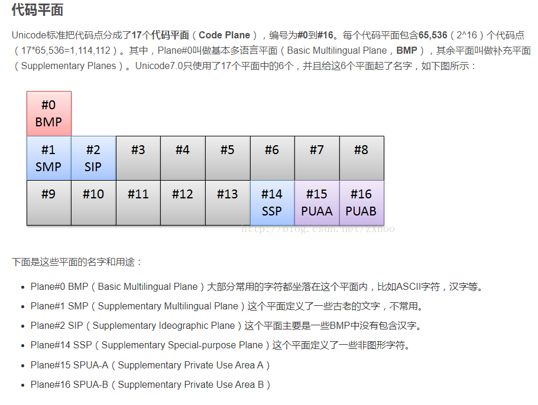
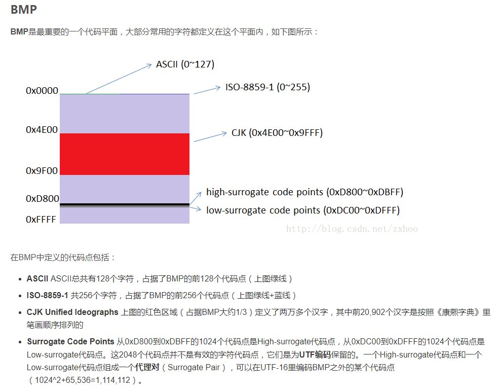
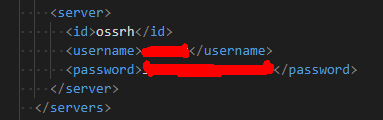
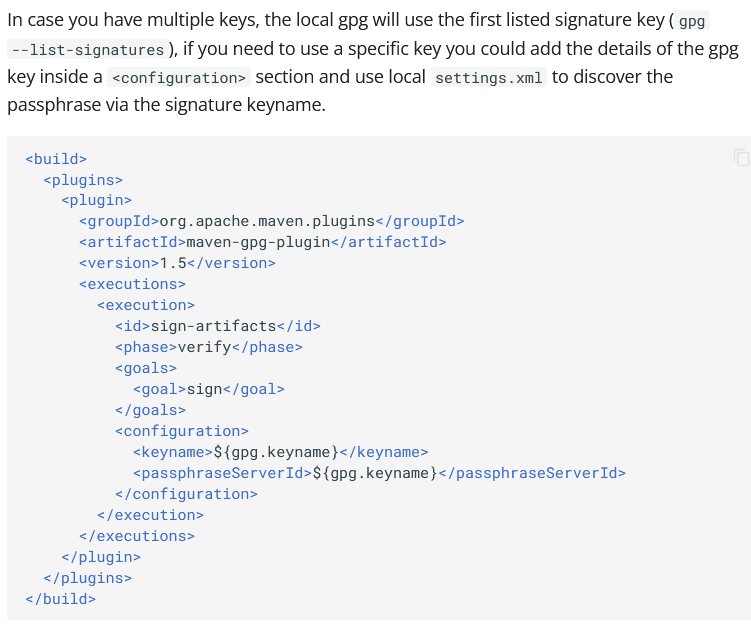
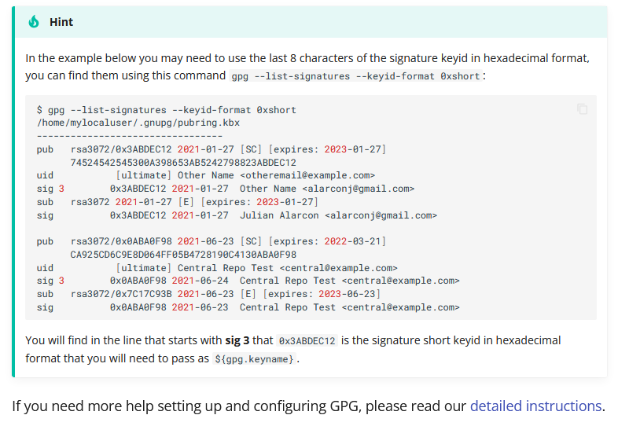

## hello world
```
假定源文件为hello.java,cmd会话的当前工作目录为d:/j20222/
hello.java文件里面定义了几个class,编译后就会有对应数量的xxx.class文件,编译器会把class的名称作为编译后的class文件的文件名，如果是嵌套class那么，会编译生成对应的 [父class名称]$[子class名称].class
场景一：在工作目录下建立hello.java,代码中不定义package,
    编译hello.java文件,注意点：javac hello.java；命令中必须有.java这个文件后缀
    执行入口类,注意点：java 入口类；命令不要包含.class这个文件后缀
场景二：在工作目录下新建hello.java,代码中定义package为io.github.eeroom.hz,
    编译hello.java文件
    执行入口类会报错,找不到类型
    解决办法:创建package对应的目录结构，把.class文件放到io/github/eeroom/hz/下,
    执行：java io/github/eeroom/hz/[入口类]
    注意点：把cmd会话工作目录切换到io/github/eeroom/hz,执行：java [入口类] 是会报错的，找不到类型
场景三：在工作目录新增子目录结构，io/github/eeroom/hz/，然后创建hello.java,定义package为io.github.eeroom.hz
    编译hello.java，以下2中方式都ok,并且编译后的.class文件都在io/github/eeroom/hz/下
    1、javac io/github/eeroom/hz/hello.java
    2、cmd会话工作目录切换到io/github/eeroom/hz目录，然后执行javac hello.java
    执行：java io/github/eeroom/hz/[入口类]
    注意点：把cmd会话工作目录切换到io/github/eeroom/hz,执行：java [入口类] 是会报错的，找不到类型
总结：执行的时候,被执行的class文件所在的物理路径和其代码中定义的package要一致,
     并且cmd会话的当前工作目录为其package定义结构对应的父级目录
```
##  进制和基本数据类型
```
二进制、十进制、16进制互转
转为十进制：
    二进制的abcd等价于十进制的值为：a*2^3+b*2^2+c*2^1+d*2^0=Value
    十进制的abcd等价于十进制的值为：a*10^3+b*10^2+c*10^1+d*10^0=Value
    十六进制的abcd等价于十进制的值为：a*16^3+b*16^2+c*16^1+d*16^0=Value
从十进制转出：
    转为二进制，参照等式a*2^3+b*2^2+c*2^1+d*2^0=Value，问题转换为已知Value,反推a,b,c,d;并且a,b,c,d的取值范围都是[0,1]
        方法：a*2^3+b*2^2+c*2^1+d*2^0===2*(a*2^2+b*2^1+c*2^0)+d===Value，也就是说最低位的d就等于Value除以2的余数。
        对应的：a*2^2+b*2^1+c*2^0=Value'，同理，c就等于Value'除以2的余数
        依次同理下去，即可得到b,a的值
    转为十六进制，参照等式a*16^3+b*16^2+c*16^1+d*16^0=Value，问题转换为已知Value,反推a,b,c,d;并且a,b,c,d的取值范围都是[0,F]
        方法：a*16^3+b*16^2+c*16^1+d*16^0=Value===16*(a*16^2+b*16^1+c*16^0)+d===Value，也就是说最低位的d就等于Value除以16的余数。
        对应的：a*16^2+b*16^1+c*16^0=Value'，同理，c就等于Value'除以16的余数，
        依次同理下去，即可得到b,a的值

1个字节===8位2进制(2的8次方)===2位16进制（16的2次方）,也就是一个字节的数值范围大小是[0x00,0xFF]
java的byte是1个字节，但是最高位是符号位，所以数值范围变为[-0x7F,0x7F]
c#的byte也是1个字节，但是没有符号位，所以数值范围[0x00,0xFF],sbyte是有符号的，和java的byte等价
```
## 二进制的负数
```
计算机内存内容都是0或者1，如果把一段字节数据按照有符号的数值来解析,±符号改如何解决呢
统一约定：这一段字节数据最高位是符号位，如果符号位值为1就是负数，否则为正数
这既符合我们直觉，规则又非常简单，类似于10进制数在最高位引入±号
基于这个规则，00 00 01 10 就等价于+6，
那么-6等价的二进制序列是多少呢？10 00 01 10？这非常符合直觉，但是计算机内存中并没有采用这种规则！
原因:对两个整数(正数或者负数或者0)进行加法运算，加法电路让符号位直接参与加法计算，这样加法电路才能足够简单！
     如果加法电路额外考虑符号位，加法电路会变得复杂的多！
回到普通的加法计算(-6+6);如果按照直觉的-6二进制序列
    10 00 01 10
  + 00 00 01 10
    10 00 11 00
这结果就变成了-12，这明显不对，当然问题原因就在于我们让符号位直接参与了运算
结论：'负数二进制序列等价于把其对应正数二进制序列的最高位改成1'这个符合直觉的负数表示规则，不能满足让符号位直接参与运算的期望！
继续回到普通减法计算(0-6);
    00 00 00 00
  - 00 00 01 10
    11 11 10 10
非常激动,11 11 10 10是否就可以作为-6的二进制序列呢？答案是肯定的，而且计算机内存就是采用这种方式！
数学原理及证明待研究。。。
上述规则总结是：负数二进制序列等价于把其对应正数二进制序列求反再加1，就是对应正数的补码！
    6的原序列   00 00 01 10
    反码        11 11 10 01
            +  00 00 00 01
    补码         11 11 10 10

反直觉：对应一个字节的有符号整数，
最大值（127）：01 11 11 11
最小值(-128): 10 00 00 00
1:            00 00 00 01 
-1:           11 11 11 11
表示不了+128，
如果需要计算-128+128，需要2个字节的有符号数，
字节数变多，同等正数值只需要在左边补0，但同等负数值的二进制序列非常不一样了！
```
## 字符和字符集
```
字符集本质上就是字符和二进制序列(代码值)的对应关系集合，如unicode,GBK
字符编码本质上就是规定如何存储字符对应的二进制序列，如果utf-8,utf-16,GBK
所以最直接的字符编码方式就是直接存储字符对应的二进制值的序列，典型案例为GBK
但是有的字符编码方式是首先对二进制序列做处理，然后存储处理过后的二进制序列，典型案例为unicode字符集的utf-8编码

unicode字符集，代码值范围是[0x000000,0x10ffff]，使用3个字节，第1个字节代码平面标识，第2、3个字节是其真正的码值
分为17代码区（代码平面），每个区都可包含0xffff+1（65536）个字符,
代码区00：[0x000000,0x00ffff]
代码区01：[0x010000,0x01ffff]
代码区02：[0x020000,0x02ffff]
依次类推
代码区15：[0x0f0000,0x0fffff]
代码区16：[0x100000,0x10ffff]

todo gbk字符集

编码：把字符串和字符转成二进制数据进行存储或传输，需要指定具体的字符编码来确定如何存放每个字符的代码值
以utf-8为例,utf-8是根据每个字符代码值大小所在的区间范围决定使用多少字节来存储该代码值，各个区间范围下，都会在固定的位上填充固定值
    说明：?表示实际的unicode代码值存放位，其它的0、1表示utf-8规范规定的固定位固定值
    区间1：[0x000000,0x00007f] 1字节 0???????
    区间2：[0x000080,0x0007ff] 2字节  110????? 10??????
    区间3：[0x000800,0x00ffff] 3字节  1110???? 10?????? 10??????
    区间4：[0x010000,0x1fffff] 4字节  11110??? 10?????? 10?????? 10??????
    区间5：[0x200000,0x3fffff] 5字节  111110?? 10?????? 10?????? 10?????? 10??????
    区间6：[0x400000,0x7fffff] 6字节  1111110? 10?????? 10?????? 10?????? 10?????? 10??????
因为unicode规范的代码值只在范围[0x000000,0x10ffff]，也就是最高到对应到utf-8的区间4，所以我们说utf-8使用1到4个字节存储字符
比如字符'我'，unicode代码值为：0x6211,那么落在区间3,
0x6211对应的二进制值为：01100010 00010001
把0x6211的二进制值落到1110???? 10?????? 10??????上就变为：[1110]0110 [10]001000 [10]010001
落的规则：01100010 00010001从低位开始依次替换1110???? 10?????? 10??????中对应的?
验证：把[1110]0110 [10]001000 [10]010001 复制到windows的计算器二进制，再切换到十六进制可看到是E6 88 91
     在editpluas中输入'我'，按utf-8保存,然后编辑》16进制查看，也可以看到E6 88 91
乱码案例：中文'联通'按GBK字符集保存后字节数据刚好是110????? 10?????? 110????? 10??????结构，对应utf-8区间2。
重新用记事本、notepad++、editeplus等工具打开后它们会认为这是utf-8编码的文件，然后就乱码，改成按ANSI(windows上表示系统默认字符集，中文就是GBK)。

解码：解析字符串、字符的二进制数据的时候，需要指定具体的字符编码来确定字节数据对应的字符
以utf-8为例，解码的时候，首先逐字节读取。
    把读取到的该字节的值和utf-8区间去匹配，即可知道当前这个字符占了N（[1,4]）个字节，
    然后就可以把这N个字节都读取出来，然后把固定位固定值移除掉，剩下值的就是unicode代码值
    移除utf-8编码中的固定位置的固定值对应的位
    合并剩余的位成为一个或多个字节的值，合并规则和上面落规则互为逆操作
    继续从N个字节后开始逐字节读取

java代码源文件的编码格式可以是utf-8，gbk等，java编译器都可以识别
但是：如果javac运行时使用GBK编码解析文件内容，utf-8编码格式的.java文件包含中文就会编译报错，'编码GBK不可以映射的字符'
同理,如果javac运行时使用utf-8编码解析文件内容，gbk编码格式的源代码文件包含中文就会编译报错
cmd启动javac不加字符编码参数，那么javac就使用GBK编码解析文件内容，因为中文系统默认就是GBK编码
IDEA启动编译时会给javac加utf-8字符集参数，所以idea默认的文件编码格式是utf-8
javac -encoding utf-8 xxx.java

不论代码源文件是何种编码格式，编译后，源代码中的字符和字符串都被被转成utf-8编码后的二进制序列储到.class文件中
tips:可以写最2个简单的java文件，一个包含中文字符，一个包含数字字符，
    编译成.class文件后，以16进制查看.class文件，通过比对找到差异点，就可以发现中文字符、数字字符都是对应utf-8编码后的二进制序列

char类型占用2个字节，每个char实例的整数值对应unicode规范中该字符的代码值(特别：不包含代码区标识位后的代码值)
```
### 
### 

### 发布jar包到maven中心仓
```
注册sonatype账号，然后提第一次发jar包的issue到sonatype，按照指导完成后，sonatype会开通一个仓库给我们。
我的jar先发到sonatype仓，然后被同步到maven中心仓
项目的pom.xml引入sonatype和gpg相关的插件,参看sln项目的pom.xml和nalu项目的pom.xml
在maven的配置文件setting.xml中配置sonatype的账号和密码，如下图
```

```
需要把我们用来发布jar包的公钥发布到sonatype指定的公钥服务器，参看sonatype文档就好
gpg插件用私钥对jar包进行签名的时候，默认会使用gpg密钥列表里的第一对密钥，可以通过增加配置，指定特定的密钥对，如下图
```


```
gpg教程
生成密钥对：gpg --genkey
查看已有的密钥列表：gpg --list-keys
每个密钥对信息的第二行那一串guid值就是keyid
导出公钥：gpg -o 公钥导出后的保存的文件  --export key的id  -a
导出私钥：gpg -o 私钥导出后的保存的文件  --export-secret-keys key的id  -a
导出私钥的时候会跳出对话让我们输入私钥的密码！
导出约定：-a是可选的，标识是否使用ascii armor，不论公钥还是私钥，如果指定这个参数，导出的保存文件就用.asc结尾，如果不指定就用.gpg结尾
小技巧：如果加了-a参数，导出的文件可以直接以普通文本查看
导入公钥：gpg --import 公钥导出后的保存的文件
导入私钥：gpg --import 私钥导出后的保存的文件
完整教程请查看pdf文件
```
gpg完整教程文档[FAQ:](./pdf/gpg教程.pdf)
## ObjectMapper序列化匿名对象
```
var mapper=new com.fasterxml.jackson.databind.ObjectMapper()
mapper.setVisibility(PropertyAccesser.ALL,JsonAutoDetect.Visibility.ANY);
mapper.writeValueAsString(new Object(){int id=1;String name="zz";});
```