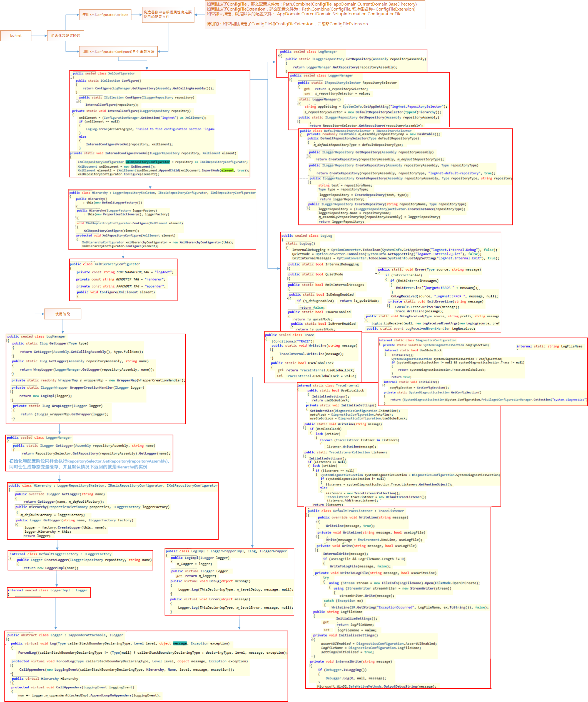

## 整数-字符-二进制序列-十六进制序列
```
整数解析规则：
  正数：最高为符号位，一定是0，转二进制序列的时候，体现在序列字符串上，高位的0都省略掉了，增加位数来表示等价的值，把所有增加的高位补0
  负数：最高为符号位，一定是1，增加位数来表示等价的值，把所有增加的高位补1
  无符号：不考虑符号位
```
-字符串-二进制序列-十六进制序列.png)

## byte和sbyte互通
```
c#:byte为无符号整数，范围：[0-255][00-FF]，
     sbyte为有符号整数，范围[-128,127][80,7F]
     互相之间直接强制类型转换即可
java:byte为有符号整数，范围[-128,127][80,7F]，等价于c#的sbyte
     java没有提供无符号的byte类型，可以使用范围更大的数据类型(比如int)进行等价表示
     无符号转对应的有符号：已知无符号的byte值unsinVal[0-255],
          对应的有符号的值：byte sinVal=(byte) ((int)unsinVal)
     有符号转无符号：已知有符号的byte值sinVal[-128,127],
          对应的无符号的值(使用int类型等价表示)：int unsinVal= ((int) sinVal) & 0xff
          或者：int unsinVal= Byte.toUnsignedInt(sinVal),本质和上面是一样的
原理分析：
0xff就是0x000000ff，进行&运算，导致另一个计算数的高6位全部变为0,只剩下原有最低的2位保持原序列值。
((int) sinVal) & 0xff的原理等价于下面的代码：
byte sinVal=-3;
var str= Integer.toHexString(sinVal);
var unsinVal=Integer.parseInt(str.replace("ffffff","000000"),16);
```
## JwtToken互通
```
JWTToken的三部分：hearder(字典)，payload(字典)，key(哈希算法的密钥)
     header:((alg:HS256 ),type:JWT ),alg根据业务需要,后续算signCode做相应的调整
     payload:数据根据业务需要
JWTToken串的计算过程：
     序列化header,然后转base64，然后做额外处理得到headerCode，
     额外处理逻辑：baser64str.Split('=')[0].Replace('+','-').Replace('/','_')
     序列化payload，然后转base64，然后额外处理，逻辑同上,得到payloadCode
     使用HMACSHA256哈希算法，
     算法的Key=key按UTF8取字节数组
     buffer=算法.ComputeHash(UTF8取字节数组(headerCode+"."+payloadCode))
     把buffer直接转base64，然后额外处理，逻辑同上，得到signCode
     最后的jwttoken=string.Join(".",headerCode,payloadCode,signCode)
互通的基础：c#和java的com.auth0>java-jwt类库兼容
互通关键点：
java的Calendar.getInstance().getTime()等价于c#中的(DateTime.Now.ToUniversalTime()-new DateTime(1970,1,1)).TotalSeconds
```
## 分布式和集群
```
现对于单机系统(应用程序,数据库等等都在一台服务器)而言,
一件具体的事情由多台不同的服务器共同完成，服务器之间存在协同；或者多台服务器可以无差别的处理同一件具体事情
依据看待事情的角度来确定怎样算一件具体的事情
用户修改密码，站在产品的功能点来看，可以看成一件事情，涉及应用程序，数据库，
站在代码处理流程的角度，也可以看成两件事情，1、http服务接收用户请求，2、数据库执行sql
对应的，把http接受用户请求搞成多台部署，就成了应用程序集群
把数据库部署多台,就成了数据库集群
所以集群一定是分布式部署，是一种特点情况下的分布式
```
## sqlserver
```
https://juejin.cn/post/7231070518223962172
声明变量
     declare @变量名称 类型
变量赋值
     set @变量名=变量值
     select @变量名=count(1) from 表
     select @变量名=列名称 from 表
       特别的：如果有多行，则变量的值是最后一行对应的值
声明临时表
     declare @表名称 table(列名称 类型，列名称 类型，...)
插入语句（表必须存在）
     insert into 表(列名称，...) values()
     insert into 表 values()
     insert into 表(列名称，...) select语句
     insert into 表 select语句
插入语句（表必须不存在）
     select 列
     into 表名
     from ....
       特别的：表名以#开头， 为临时表，会话结束后自动删除，否则为非临时表
更新语句（连表）
     update 表 别名1
     join 表2 别名2 on 连接条件
     set 别名1.列=别名2.列
     where ....
删除语句（连表）
     delete 别名1 
     from 表1 别名1
     join 表2 别名2 on 连接条件
     where 筛选条件
output语句
     insert into 表(列) output inserted.列名 values()
     update 表 set 列1=值 output inserted.列名 where ...
分支语句
     if (@变量=3)
          begin
          ...
          end
     else
          begin
          ...
          end
循环语句
     while @变量=3
          begin
          ...
          end
序列
     create SEQUENCE 序列名称 AS 类型    START WITH 初始值    INCREMENT BY 步长    [CYCLE]
     drop SEQUENCE 序列名称
       特别的：需sqlserver2014及以后的版本才支持
集合操作
     取差集：except 
     取并集：union
     取交集：intersect
调试
     存储过程和触发器可以在ssms中直接进行调试
     打开存储过程和触发器的代码，对应的修改或者创建语句都可以，打上断点
     新建一个查询窗口，编写调用存储过程的语句或者编写增删改的语句，打上断点，从菜单栏中的调试菜单启动调试，F11即可进入逐行调试
触发器
     触发器的代码执行的时候，总是发生在增删改完成以后
     触发器或者存储过程代码中查询触发器所在表的时候一定要考虑到上述情况
文件组
     ALTER DATABASE 数据库 ADD FILEGROUP 文件组名称
表分区的操作步骤：
  添加文件组和文件
  创建分区函数：create partition function 名称(分区字段类型) as range right for values(区间值1,区间值2,,,)
  创建分区scheme:create partition scheme 名称 as partition 分区函数名称 to(文件组1,文件组2,,,)
  tips:文件组个数=区间值个数+1，因为5个区间值对应6个区间段，需要对应6个文件组，,不同的分区可以使用相同的文件组
  创建分区表：create table 表名称(列1名称 类型，列2名称 类型,...)on 分区scheme(分区字段)
  创建聚集索引[且唯一索引]：create [unique] clustered index 索引名称 on 表名称(列名称 ASC或DESC [,列名称2 ASC或DESC]) ON 分区scheme(分区字段)
  创建非聚集索引[且唯一索引]：create [unique] nonclustered index 索引名称 on 表名称(列名称 ASC或DESC [,列名称2 ASC或DESC]) ON 分区scheme(分区字段)
  特别地：如果是唯一索引，则索引列中一定要包含分区列！
  设定主键本质就是创建唯一聚集索引，所以分区表如果创建主键，则一定要包含分区列
分区表查询
  查询具体的数据会落在哪个分区：select $partition.分区函数名 ('具体数据对应分区列的值，比如："2020-06-04"')
  返回值是分区序号，从1开始
  查询指定分区序号下的所有记录：select * from 表名 where $partition.分区函数(分区列)=分区序号
分区表清理的操作步骤
  创建临时表，结构和源表一样，使用相同的 on 分区scheme(分区字段)
  确定要删除的分区的序号，分区序号从1开始，计算序号的逻辑，借助临时表，键值结构(月份，序号)
  切换别删除分区的数据到临时表：alter table 源表 switch partition 分区序号 to 临时表 partition 分区序号
  删除临时表：drop table 临时表
  释放磁盘空间
分区表清理的场景
  某个数据文件可能有一个或多个分区的数据落在这个文件上，但是这些分区的数据业务上已经没有意义
  需要清理分区数据，加快查询速度
  需要释放磁盘空间，降低磁盘占用
  清理分区数据后，分区对应的数据文件仍然存在，文件大小不会改变
  删除分区表对应的临时表后，临时表的数据文件仍然存在，文件大小不会改变
释放磁盘空间的操作步骤：
  确保数据文件对应的分区已经被清理
  确保数据文件所在的分组在释放后还至少有一个文件，如果该数据文件是所在文件组中的唯一文件，需要提前添加一个新文件到所在文件组
  执行收缩：DBCC SHRINKFILE([文件名称],EMPTYFILE)，
    即使文件很大，T级别，收缩也很快，收缩成功后，文件大小并不会改变，也就是不会释放磁盘空间
  执行删除数据文件：ALTER DATABASE [数据库] REMOVE FILE [文件名称]
    文件删除后，才真正的释放了磁盘空间
水平分区
  表结构不变，数据落在不同的文件
  优点：
  文件可以落在不同的磁盘，按照分区条件查数据的时候性能大大提高
  极大的方便不停机归档数据，如果不分区进行归档数据，有两个土办法(往归档表写，往原表删；或者：原本重命名，新建原表，往原表回写)
数据监测（循环语句和临时表实现）
  场景：分析生产环境bug，只有查询权限，不能创建触发器，不能创建建表。
  bug：分布式系统中，程序员预期按照步骤T1,T2,T3的顺序修改某个字段，代码的逻辑判断依赖该字段值，实际情况出现了步骤T1,T3,T2的更新顺序，导致bug
  目的：得到某个字段值的变化情况
  实现方法：创建临时表,循环语句,定时查询需要监视的数据字段，把查询结果和当前时间（作为写入时间）添加到临时表中，按照写入时间排序就是字段的变化过程
  create table #表名称(列1 列1的类型,列2 列2的类型,......,写入时间 datetime)
  while 1=1
  begin
     --等待500毫秒，小时:分钟:秒:毫秒
  	WAITFOR DELAY '00:00:00:500'
  	insert into #表名称(列1,列2,...,写入时间)
  	select 列a,列b,...,getdate()
  	form ...
  	where ....
  end
切割字符串（split函数）
  CREATE FUNCTION splitToString
  (
  	@str nvarchar(1000),
  	@splitstr nvarchar(10)
  )
  RETURNS @returntable TABLE
  (
  	v1 nvarchar(100)
  )
  AS
  BEGIN
  	DECLARE @xmlstr XML;
      SET @xmlstr = CONVERT(XML, '<root><a>' + REPLACE(@str, @splitstr, '</a><a>') + '</a></root>');
      INSERT INTO @returntable
      SELECT F1 = N.a.value('.', 'varchar(100)') 
  	FROM @xmlstr.nodes('/root/a') N(a);
  	RETURN;
  END
切割字符串（使用示例）
     select *
     from INFORMATION_SCHEMA.COLUMNS cc
     join splitToString('1,3,4,5,6,aa',',') t2 on t2.v1=cc.COLLATION_NAME
数据库已执行的sql语句的历史纪录（查询系统表）
  select eqs.creation_time as 首次次执行时间,eqs.last_execution_time 末次执行时间,eqs.execution_count 总次数,eqt.text sql语句,eqt.*,eqs.*
  FROM  sys.dm_exec_query_stats eqs CROSS APPLY sys.dm_exec_sql_text(eqs.sql_handle) eqt
  order by eqs.last_execution_time desc
  特别的：只能知道首次和末次执行时间，如果每次执行的语句相同，则总次数会增加，但是不知道中间每次执行的具体时间
```

## mysql
```
--声明变量
declare 变量名称 类型;
--变量赋值
set 变量名=变量值;
select nextval('序列名称') into 变量名 form dual;
select count(1) into 变量名 from 表;

--分支语句
if 变量=1 then
     begin
     ...
     end
else
     begin
     ...
     end
end if

--创建存储过程
--mysql默认的分隔符是;号,解释器遇到;号就会认为这是一行可以执行的语句然后执行
--存储过程内部有一行或者多行普通的sql语句并且以;结束，所以需要使用delimiter把分隔符改成其它符号，避免误导解释器
delimiter $$
drop procedure if exists addHandler;
create procedure addHandler()
begin
     declare errorFlag int default 0;
     declare continue handler for sqlexception set errorFlag=1;
     start transaction;
     insert into student (name,age) values('张三',10);
     insert into student (name,age) values('李四',12);
     if errorFlag=1 then
          rollback;
     else
          commit;
     end if;
end  $$
--执行存储过程
call addHandler;
--异常处理
declare continue handler for sqlexception set errorFlag=1;
--异常处理
declare continue handler for sqlexception rollback;  
--更新语句（连表）
update 表1 别名1
join 表2 别名2 on 连接条件
set 别名1.列名1=别名2.列名2
where 筛选条件
```

## oracle
```
表名和列名称区分大小写,sql语句中的表名和列表都会被默认转为大写
场景:表名是小写,执行sql报错:表不存在或列不存在
原因:sql语句中的小写表名被转成大写,然后的表名称又是小写,导致找不到表
解决办法:sql中的表名加上双引号,oracle就不会自动把sql中表名转大写

oracle安装教程：
先只装数据库程序文件
然后使用net configer 工具设置监听
然后使用database configer工具安装数据库实例,调整字符集
完成安装

使用1：INSERT INTO TEST(ID,Name) VALUES(NEXT VALUE FOR 序列名称, 'allen')
使用2：SELECT NEXT VALUE FOR 序列名称

数据库客户端navicat lite依赖oci,所以需要安装oracle client或者odp.net,然后设置oci路径

TNS模式连接数据库,需要配置tsname.ora文件,文件路径为：{oracle client或者odp.net的根目录}/NetWork/ADMIN/tsname.ora
{oracle client或者odp.net的根目录}/NetWork/ADMIN/Simpale/下有示例ora文件,照着改即可

.net程序引用odp.net程序集,然后正常走ado.net即可

待研究：oracle提供新的100%托管程序集,应该可以不用走TSN模式连接了
```

## Entity Framework(ef)
```
数据迁移基本操作
启用迁移：Enable-Migrations
增加一个版本：Add-Migration 版本名称
     只需要指定版本名称,工具会自动加上日期前缀
更新到最新版本：Update-Database -Verbose
更新到指定版本(支持回退版本):Update-Database –TargetMigration:版本名称
获取从A版本更新到B版本对应的sql脚本：Update-Database -Script -SourceMigration:版本A -TargetMigration:版本B
宏变量，0版本名称：$InitialDatabase

手工操作初始化数据库结构
前提：关闭ef的数据库初始化策略：System.Data.Entity.Database.SetInitializer<HFDbContext>(null);
使用工具或者代码创建数据sdf数据文件：compactview
把项目设定为启动项目,vs的原因,ef迁移工具会从启动项目中读取数据库连接串!
在包管理控制台中把项目选为默认项目，
更新数据机构到最新版本：Update-Database -Verbose
适合线上变更场景,生成变更用的幂等sql脚步,可以将当前任何版本的数据库升级到最新版本：
     Update-Database -Script -SourceMigration:$InitialDatabase -TargetMigration:AddPostAbstract

ef策略初始化数据库
CreateDatabaseIfNotExists:默认策略，数据库不存在，生成数据库；一旦model发生变化，抛异常，提示走数据迁移。
     Database.SetInitializer<HFDbContext>(new System.Data.Entity.CreateDatabaseIfNotExists<HFDbContext>());
     这样等价上面的手工操作
DropCreateDatabaseAlways：数据库每次都重新生成，仅适用于开发和测试场景
DropCreateDatabaseIfModelChanges：一旦mode发送变化，删除数据库重新生成
自定义策略,自己实现约定接口即可
上述方式会删掉原有的旧数据，仅适合新部署或搭建新的本地环境，不适用线上环境变变更等场景，
MigrateDatabaseToLatestVersion：自动数据迁移,程序起来后，会自动更新数据库结构到最新的版本
修改数据库初始化策略为：
     Database.SetInitializer<HFDbContext>(new MigrateDatabaseToLatestVersion<HFDbContext,Migrations.Configuration>());
修改迁移配置类，
     在构造函数设置启用自动迁移：this.AutomaticMigrationsEnabled = true;
     启用允许修改表结构：this.AutomaticMigrationDataLossAllowed = true;
非常适合用于开发阶段场景：
     表结构和表数量经常变动，但是不丢失已有的一些假数据，我们只需要在修改表结构后，增加一个版本，重新启动程序即可

tips
compactview工具打开sdf文件后会，如果使用MigrateDatabaseToLatestVersion策略更新表结构会失败,但是查询数据是可以的
```

## sqlservercompact
```
程序集：Install-Package Microsoft.SqlServer.Compact -Version 4.0.8876.1
连接字符串：Data Source=|DataDirectory|httpfile.sdf;Password=123456;Persist Security Info=True
建表：
create table Abc(
id int primary key identity(1,1),
Name nvarchar(100),
CardId uniqueidentifier not null
)

使用ef：Install-Package EntityFramework.SqlServerCompact -Version 6.4.4
```

## lambda表达式树，动态创建表达式树
```
var sortName = context.Request["sortName"];
var parameterExp = System.Linq.Expressions.Expression.Parameter(typeof(Model.FileEntity), "mq");
var getpropValueExp = System.Linq.Expressions.Expression.PropertyOrField(parameterExp, sortName);
var getpropObjectValueExp = System.Linq.Expressions.Expression.Convert(getpropValueExp, typeof(object));
var lex = System.Linq.Expressions.Expression.Lambda<Func<Model.FileEntity, object>>(getpropObjectValueExp, parameterExp);
lstQuery = lstQuery.OrderBy(lex);
```
## lambda表达式树，动态查询
```
等价的sql逻辑为：字段a like "%value1" || 字段a like "%value2"|| 字段a like "%value3" || ... 
var dbcontext = new Model.DbContext();
System.Linq.Expressions.Expression<Func<Model.Log, string>> exp = x => x.Name;
var lst = new List<string>() { "zhaozehui", "aaa", "bbb" };
var lstexp = lst.Select(value =>
{
     var likevalue = System.Linq.Expressions.Expression.Constant(value);
     var likeexp = System.Linq.Expressions.Expression.Call(exp.Body, typeof(string).GetMethod("StartsWith", new Type[] { typeof(string) }), likevalue);
     return System.Linq.Expressions.Expression.Lambda<Func<Model.Log, bool>>(likeexp, exp.Parameters);

}).ToList();
var tmpbody = lstexp[0].Body;
for (int i = 1; i < lstexp.Count; i++)
{
     tmpbody = System.Linq.Expressions.Expression.Or(tmpbody, lstexp[i].Body);
}
var whereexp = System.Linq.Expressions.Expression.Lambda<Func<Model.Log, bool>>(tmpbody, exp.Parameters);
var lstlog= dbcontext.Log.Where(whereexp).ToList();
```

## log4net
```
配置：
使用：
```
### 
## docker发布和部署netcore程序
```
dockerfile内容如下：
FROM microsoft/aspnetcore:2.0
#指定一个workdir，目录随便
WORKDIR /app
#把相对dockerfile所在目录的相对路径的文件 复制到 workdir相对路径的位置
COPY . .
#声明系统运行需要用到的端口，只是声明，方便创建容器的人知道需要处理哪些端口映射
expose 80
#等价于cmd的dotnet命令 
ENTRYPOINT ["dotnet", "Azeroth.Klz.dll"]

解决方案的项目文件设定dockfile文件为编译输出，这样可以把dockerfile文件总是复制到发布后的目录，方法如下：
  修改项目文件，增加一行：<None Include="Dockerfile" CopyToPublishDirectory="Always" />
dotnet publish [-r linux-x64 交叉编译,通常不需要]  
  发布，生成依赖于运行时的跨平台二进制文件
windows的docker客户端连接docker服务端
  配置一个环境变量，避免每次指定-H参数
docker build -t 镜像名称 dockerfile的路径
  eg. docker build -t wch .\bin\Debug\netcoreapp2.0\publish\
docker run -it --rm -p 5000:80 --name=wch123 wch
  docker run -it --rm -p 容器外部端口:容器内部端口 --name=容器名称 镜像名称
访问：http://192.168.56.101:5000/api/values
步骤总结为：发布程序，build镜像，创建容器及运行，删掉tag是none的镜像（也就是老版本的镜像）
脚步内容：
dotnet publish
docker build -t wch .\bin\Debug\netcoreapp2.0\publish\
docker stop wch123
docker rm wch123
docker run -d -it --rm -p 5000:80 --name wch123 wch
docker images|grep none|awk '{print $3 }'|xargs docker rmi
```
微软文档[dotnet publish的FAQ:](https://docs.microsoft.com/zh-cn/dotnet/core/tools/dotnet-publish)

## HTTP上传文件
```
分片上传
浏览器支持，前提，文件API，File类
发起多次请求，浪费时间
请求特征和普通请求一致，常见的web服务器都支持

流式上传
浏览器支持，通过xhr可以获取上传进度，fetch不方便获取进度
需要服务端支持，IIS，tomcat都支持，aspnetcore的Kestrel服务器支持，遇到中间有代理的情况，可能就失效
只发起一次请求
关键请求头：content-type: application/octet-stream
如果不能提前确定上传内容的长度，例如：一边打包一边上传的场景
     Transfer-Encoding: chunked
     
和流式下载是对应的

curl的例子：
curl -X POST -v -T D:/Downloads/2003-MSDN.iso -H "Content-Type: application/octet-stream" --header "Transfer-Encoding: chunked"   "http://localhost:8083/HandlerBigFile.ashx"

c#的例子
var request= (HttpWebRequest)System.Net.HttpWebRequest.Create("http://localhost:8083/HandlerBigFile.ashx");
request.Method = System.Net.WebRequestMethods.Http.Post;
request.KeepAlive = true;
request.SendChunked = true;
//只设置request.SendChunked，效果就是请求头走Transfer-Encoding，不走Content-Length
//request.TransferEncoding = "chunked";
request.ContentType = "application/octet-stream";
request.Pipelined = true;
//上传大文件必须设置为false,否则导致客户端占用大量内存
request.AllowWriteStreamBuffering = false;
//默认是100s，大文件场景时间很长，-1为一直等待，不做超时检测
request.Timeout = -1;
using (var fs=new System.IO.FileStream("E:\\W7Dell5490MSDN.GHO", System.IO.FileMode.Open)) {
     //这一步就会发送请求到服务端，到达我们的逻辑代码，
     //如果是表单提交，则不行，服务端的框架代码会先读取整个请求体，然后解析出表单提交的内容
     var stream = request.GetRequestStream();
     var bufferSize =8192;
     var buffer = new byte[bufferSize];
     var length = 0;
     while ((length=fs.Read(buffer,0,bufferSize))>0) {
          stream.Write(buffer, 0, length);
     }
}

socket 发送缓冲区 接收缓冲区
我们代码中的socket客户端或者服务端，只是名字是socket，read和write仅仅只是从缓冲区读或者写数据
操作系统负责把缓冲区的数据写入真正的socket然后发送到目标端
操作系统负责从真正的socket中获取数据然后放到缓冲区
soket协议约定：
如果发送缓冲区满了，则往发送缓冲区写入数据的业务代码会阻塞，直到缓冲区数据被操作系统取走，如果是异步写入模式就返回特定的失败标识
如果接收缓冲区满了，就会通知对端停止发送，等到业务代码把接收缓冲区中的数据被取走了，才通知对端继续发送
如果接受缓冲区没有数据，则读取接收缓冲区数据的业务代码阻塞，直到接收缓冲区中有数据

http请求中常见的content-type值，iis和tomcat的默认处理策略
content-type=表单   不能立即到达业务代码，服务端会读取请求流的内容，并且解析为字典形式表单数据及文件流，对请求体长度有限制
content-type=application/json 不能立即到达业务，asp.net mvc、spring mvc等框架会有参数绑定、参数解析器等前置处理，读取请求体内容然后反序列化
content-type=application/octet-stream  可以立即到达业务，asp.net mvc、spring mvc等框架目前都不会额外这类请求，iis会校验请求体长度，最大2GB，tomcat不会校验长度

Transfer-Encoding和Content-Length请求如果同时出现，则忽略Content-Length
对于发送请求之前，或者发送响应之前不能确定内容长度，就使用Transfer-Encoding=chunked ，比如变打包边上传，或者边打包边下载
Transfer-Encoding=chunked可以绕过iis和asp.net对请求内容长度的前置校验，但是业务代码读取请求流内容的时候仍然受到长度限制，
     asp.net 4.5版本提供新的api, HttpRequest.GetBufferlessInputStream()可以忽略长度限制
     aspnetcore的kerstral服务器在这种场景下没有长度限制

总结：上传大文件>10G，浏览器侧把文件分成多个块上传，比如（200MB一块），块的体积太小（使用表单提交）会导致大量的请求，严重降低整体效率
使用content-type=application/octet-stream进行提交，其他的参数值放在请求头，这样请求可以立即到达业务代码，避免被服务端读取进行缓存，然后我们再读取
浏览器的xhr和fetech目前不支持设置请求头Transfer-Encoding=chunked

总结：http请求本身很简单，默认情况下，请求可以立即到达业务代码，但是服务端和各种框架会对某些类型的请求做一些前置处理，
比如：content-type=multipart/form-data;boundary=xxxx 类型的请求
服务端可能会校验请求提长度
asp.net springmvc等框架会读取请求流的内容并进行解析，普通文本就转化为键值对，文件内容就创建一个新的内存流来存储请求流中对应的数据，上传大文件的场景就非常浪费
iis和servelet中，请求流都只能被读取一次

响应头Transfer-Encoding=chunked配合Rang响应头实现断点续传和多线程下载
浏览器下载功能都支持解析这两个响应头进行断点续传


```
